## ezTrack
#### Integrantes:
- <a href="https://www.linkedin.com/in/danielzular/">Daniel Zular</a>
- <a href="https://www.linkedin.com/in/davi-motta/">Davi Motta</a>
- <a href="https://www.linkedin.com/in/luizarsantana/">Luiza Santana</a>
- <a href="https://www.linkedin.com/in/mateus-mar%C3%A7al-212953264/">Mateus Marçal</a>
- <a href="https://www.linkedin.com/in/omatheusrsantos/">Matheus Ribeiro dos Santos</a>
- <a href="https://www.linkedin.com/in/stefano-parente-652822244/">Stefano Parente</a>

## Sumário

[1. Introdução](#c1)

[2. Objetivos e Justificativa](#c2)

[3. Metodologia](#c3)

[4. Desenvolvimento e Resultados](#c4)

[5. Solução Proposta](#c5)

[6. Conclusões e Recomendações](#c6)

[7. Referências](#c7)

## 1. Introdução

&emsp;&emsp;Neste documento, apresentamos o projeto desenvolvido em parceria entre o Inteli (Instituto de Tecnologia e Liderança), ezTrack (grupo de desenvolvedores), Alliance e SAP (Systems, Applications and Products in Data Processing). A Alliance é uma empresa brasileira de consultoria especializada em soluções tributárias, focada na redução de custos fiscais, eficiência operacional e governança tributária. Tendo a SAP como principal parceira de negócios, a SAP desenvolve software ERP (Enterprise Resource Planning) para gerir os recursos de grandes empresas em diversos países, incluindo o Brasil, com diversos parceiros que realizam modificações e desenvolvem novas features para personalizar o produto para o mercado nacional.

&emsp;&emsp;Apesar de ser referência na área fiscal por muitos anos de atuação e excelentes resultados, a Alliance enfrenta o desafio de se diferenciar no mercado de supply chain. Para atingir esse objetivo, a empresa possui a estratégia de desenvolver um produto associado ao principal parceiro SAP, mais especificamente o SAP Ariba, um software que facilita o processo de compras das empresas, conectando-as aos fornecedores dos produtos solicitados. Este produto visa facilitar o processo de cotação das empresas-clientes, calculando o preço médio dos produtos para otimizar o processo de compra de produtos internos das empresas-cliente e compliance.

&emsp;&emsp;Para solucionar esses desafios, a Alliance busca um software que permita o registro das transações realizadas e o cálculo do preço médio dos produtos, de modo que não seja possível identificar as diferentes partes da transação (compradores e vendedores). Além disso, os dados não podem ser facilmente manipulados e devem ter confiabilidade para que todos os clientes realmente confiem nas informações fornecidas para fins de consulta no momento de compra de produtos internos para suas respectivas empresas.

&emsp;&emsp;Dessa forma, surge um problema natural que a tecnologia Blockchain resolve. Ao longo deste documento, detalharemos o projeto de Blockchain para facilitar o processo de cotação das empresas-clientes da Alliance. Abordaremos as etapas, metodologias e expectativas de resultados, visando oferecer uma compreensão clara da importância do projeto e como ele aprimorará as operações de cotação, otimizando a gestão de recursos financeiros e regulatórios.

## 2. Objetivos e Justificativa
### 2.1 Objetivos

&emsp;&emsp;Os objetivos gerais de um projeto são as metas amplas e conceituais, enquanto os objetivos específicos são as metas detalhadas e mensuráveis que contribuem para a realização dos objetivos gerais. Tendo conhecimento disso, as metas gerais da equipe, relacionadas ao projeto, são: desenvolver uma rede blockchain para coletar e analisar dados de cadeia de suprimentos, com o propósito de dinamizar o processo de cotação, aumentando a transparência e segurança na contratação de fornecedores.

&emsp;&emsp;Enquanto os objetivos específicos são:
1. Desenvolver smart contracts que registrem e calculem o preço médio de produtos.
2. Utilizar o histórico de transações entre fornecedores e clientes registrados na blockchain para calcular o preço médio de mercado.
3. Projetar e desenvolver uma interface de usuário amigável que permita a visualização do preço médio de determinado produto.
4. Realizar testes automatizados em Solidity.

&emsp;&emsp;Logo, o projeto tem o potencial de melhorar significativamente a experiência de fornecedores e compradores no processo de cotação de produtos. A interface amigável e os smart contracts da blockchain facilitarão a obtenção de informações sobre o valor médio de produtos no mercado. A tecnologia blockchain garantirá que as informações sejam confiáveis e possam ser auditadas por qualquer pessoa. E os testes automatizados garantirão que o MVP funcione de forma eficiente.

### 2.2 Justificativa

&emsp;&emsp;A justificativa para a existência do projeto reside na necessidade identificada pela Alliance de se diferenciar no mercado de supply chain, enfrentando desafios como a falta de transparência e ineficiência nos processos de cotação. Como resposta a esses desafios, surge a solução de desenvolver um produto com tecnologia blockchain, que permite um registro seguro e imutável das transações das empresas-clientes, calculando, assim, um preço médio confiável que pode proporcionar uma negociação mais justa e eficiente.

&emsp;&emsp;A solução proposta visa também combater a manipulação de dados e garantir a integridade das informações nas transações, tornando as compras e vendas seguras e fundamentadas. Essa inovação reforça a transparência e a confiabilidade no ambiente de negócios, permitindo que as empresas-clientes da Alliance otimizem seus processos de decisão e recursos financeiros, agregando valor significativo à oferta da Alliance e destacando-a no mercado.

### 2.3 Proposta de solução

&emsp;&emsp;A proposta de solução a ser desenvolvida para a Alliance, a fim de endereçar suas atuais dores, é uma plataforma em Web2 que forneça os preços médios dos produtos comercializados por fornecedores. Isto se fará possível a partir do registro de preços de compra e venda de produtos na Blockchain (Web3), os quais fornecerão dados suficientes para calcular a média de preço de cada produto presente na plataforma.

&emsp;&emsp; Assim, o benefício trazido aos compradores e fornecedores é o aumento da eficiência operacional e o facilitamento de processos de cotação e negociação, dado que o preço médio auxiliará na busca de valores de venda mais justos para os produtos que serão negociados. Além disto, cabe ressaltar que o registro de transações de compra e venda será realizado na Blockchain devido a características como transparência, imutabilidade e confiabilidade presentes nesta e que ajudam na prevenção de fraudes. 

## 3. Metodologia

&emsp;&emsp;Com o propósito de melhorar a organização e fornecer um suporte mais eficiente as atividades de arquitetura implementadas na solução, decidimos adotar o sistema RM-ODP (Reference Model of Open Distributed Processing). Essa abordagem se baseia em um modelo de referência amplamente reconhecido e utilizado, que fornece diretrizes e padrões para o desenvolvimento de sistemas distribuídos.

&emsp;&emsp;Ao empregar o sistema RM-ODP, estabelecemos uma estrutura sólida e consistente para a arquitetura, o que facilita a compreensão e a comunicação entre os diversos componentes do sistema. Além disso, o modelo oferece um conjunto de conceitos e notações padronizadas, possibilitando uma documentação clara e precisa das decisões arquiteturais adotadas.

&emsp;&emsp;Ao detalhar cada etapa da metodologia, temos:

* Viewpoint de Negócio:
    

    * Objetivos: Identificamos os objetivos da solução, incluindo a dinamização do processo de cotação, aumento da transparência e segurança na contratação de fornecedores.
    

    * Processos de Negócio: Analisamos os processos de cotação afetados pela implementação da solução, identificando suas interações e dependências, e avaliando como a solução pode otimizar esses processos.

* Viewpoint Computacional:
    

    * Hardware: Identificamos as plataformas de hardware necessárias para suportar a solução, considerando as especificações técnicas para garantir o desempenho adequado.
    

    * Software: Definimos os requisitos de software para cada plataforma, incluindo o SAP Business Technology Platform (BTP), e os protocolos de comunicação a serem utilizados.

* Viewpoint de Engenharia:
    

    * Componentes e Serviços: Definimos os componentes, módulos e serviços necessários para a solução, incluindo o aplicativo conectado ao BTP e à blockchain para processos de cotação de fornecedores.
    

    * Técnicas de Desenvolvimento: Especificamos as técnicas de desenvolvimento, testes e implementação a serem utilizadas para garantir a qualidade e eficiência do sistema.

* Viewpoint de Tecnologia:
    

    * Infraestrutura de Rede: Avaliamos as opções de infraestrutura de rede para suportar a solução, garantindo a conectividade e disponibilidade necessárias.
    

    * Segurança: Analisamos os serviços de segurança disponíveis para proteger os dados e transações na plataforma, garantindo a integridade e confidencialidade das informações.

* Viewpoint de Informação:
    

    * Requisitos de Informação: Identificamos os requisitos e mecanismos de gerenciamento de informações necessários para o funcionamento da solução, incluindo estruturas de dados e formatos de dados a serem utilizados.

## 4. Desenvolvimento e Resultados

&emsp;&emsp;Neste documento, oferecemos uma análise abrangente do empreendimento, empregando uma variedade de estruturas, como Oceano Azul, Matriz de Risco, Canvas de Proposta de Valor e Análise Financeira. A meta é adquirir uma compreensão mais aprofundada da organização com a qual planejamos estabelecer colaboração. Este registro atua como uma ferramenta para desvendar a empresa, suas atividades e suas perspectivas no mercado, proporcionando uma base sólida para decisões e estratégias futuras no âmbito empresarial.

### 4.1. Compreensão do Problema

#### 4.1.1. Matriz do Oceano Azul

&emsp;&emsp;A estrutura conceitual conhecida como "Oceano Azul" foi concebida por W. Chan Kim e Renée Mauborgne em 2005, com o propósito de fornecer uma abordagem estratégica inovadora às organizações. Seu objetivo é incentivar a exploração de novos territórios de mercado, em contraposição à competição intensa em mercados saturados. Os idealizadores, Kim e Mauborgne, propõem que as empresas busquem oportunidades de crescimento em "oceanos azuis", áreas inexploradas e desprovidas de concorrência. Dentro desse framework, uma ferramenta crucial é a matriz de Avaliação de Valor, que auxilia as empresas na identificação e exploração de novos mercados, comparando atributos como qualidade, praticidade, custo-benefício, entre outros.

&emsp;&emsp;Adicionalmente, para distinguir as empresas que adotam a abordagem do "Oceano Azul", é implementada uma estratégia resumida nas ações: Reduzir, Eliminar, Aumentar e Criar. Estas ações visam diferenciar as empresas e produtos, permitindo que se destaquem em ambientes de mercado não convencionais e inexplorados.

&emsp;&emsp;<b>Reduzir</b>: Nessa estratégia, a intenção é diminuir ou simplificar características presentes em produtos ou serviços tradicionais, considerando que a mudança não impacta negativamente o usuário.

&emsp;&emsp;<b>Aumentar</b>: Nessa estratégia, o foco está em ampliar os atributos valorizados pelos clientes, com o objetivo de proporcionar maior valor e eficiência do que os concorrentes oferecem aos usuários finais.

&emsp;&emsp;<b>Criar</b>: Essa estratégia envolve a introdução de um novo atributo, representando o diferencial da solução em relação aos demais concorrentes.

&emsp;&emsp;<b>Eliminar</b>: Nessa estratégia, a abordagem inclui a remoção de atributos que a concorrência pode considerar essenciais, mas que, na realidade, não afetam significativamente o valor percebido pelo cliente.

#### 4.1.2 Matriz de Avaliação de Valor

&emsp;&emsp;A fim de conduzir a avaliação de valor, foram investigadas empresas concorrentes que apresentassem alguma afinidade com a solução desenvolvida.

Algumas dessas empresas incluem:

&emsp;&emsp;<b>Deloitte:</b> A Deloitte é uma empresa global de consultoria com ampla gama de serviços, incluindo soluções de RH e tecnologia. Possui experiência global em diversos setores e forte reputação, sendo uma marca reconhecida no mercado. No entanto, suas soluções podem ser mais genéricas e menos personalizadas, além de ter custos mais elevados que a Alliance Consultoria. A Deloitte foca principalmente em grandes empresas, dando menos atenção às PMEs.

&emsp;&emsp;<b>PwC:</b>
A PwC é outra empresa global de consultoria com foco em soluções de RH e tecnologia inovadoras. Possui experiência na implementação de soluções complexas e uma rede global de profissionais qualificados. As soluções da PwC podem ser menos customizadas que as da Alliance Consultoria e seus custos também podem ser mais altos. A PwC foca principalmente em grandes empresas, dando menos atenção às PMEs.

&emsp;&emsp;<b>EY:</b>
A EY é uma empresa global de consultoria com expertise em gerenciamento de projetos e implementação de soluções. Sua abordagem é focada na otimização de processos e possui experiência em diversos setores. No entanto, a EY tem menor foco em soluções de RH e tecnologia, e suas soluções podem ser menos customizadas que as da Alliance Consultoria. Os custos da EY também podem ser mais altos.

&emsp;&emsp;<b>KPMG:</b>
A KPMG é uma empresa global de consultoria com foco em soluções de auditoria e compliance. Sua abordagem é focada na mitigação de riscos e possui experiência em diversos setores. A KPMG tem menor foco em soluções de RH e tecnologia, e suas soluções podem ser menos customizadas que as da Alliance Consultoria. Os custos da KPMG também podem ser mais altos.

&emsp;&emsp;Com fundamentação nas informações dessas empresas, elaborou-se uma tabela que apresenta os valores de cada atributo associado a cada empresa. Posteriormente, foi desenvolvido um gráfico para proporcionar uma visualização das disparidades entre os concorrentes em termos de atributos e características específicas.

| Atributos     | Alliance Consultoria | Deloitte | PwC | EY | KPMG |
|---------------|----------------------|----------|-----|----|------|
| Audiência     | 5                    | 10       | 10  | 10 | 10   |
| Qualidade     | 8                    | 7        | 7   | 6  | 7    |
| Tecnologia    | 10                   | 8        | 8   | 6  | 7    |
| Personalização| 3                    | 5        | 5   | 4  | 5    |
| Confiabilidade| 9                    | 7        | 8   | 7  | 8    |
| Transparência | 10                   | 6        | 9   | 10 | 7    |
| Segurança     | 10                   | 10       | 8   | 8  | 8    |
| Eficiência    | 10                   | 7        | 7   | 7  | 7    |

Tabela 1: Valores dos Atributos de cada Empresa

 

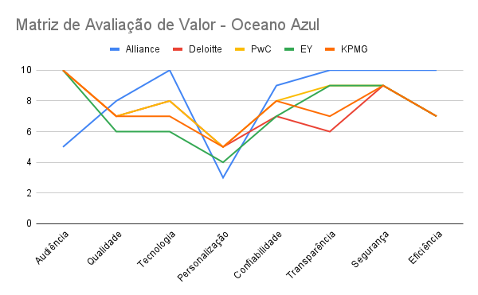

Figura 1: Avaliação de Valor baseado na Tabela 1.

## Atributos da Tabela Comparativa e suas Posições

<b>Reduziu</b>
<ul>
    <li><b>Audiência:</b> Para ter como foco outros atributos, a Alliance optou por reduzir a audiência que visa alcançar com seus serviços. Assim, O público-alvo da Alliance consiste, principalmente, em empresas de pequeno e médio porte.

</ul>

<b>Aumentou</b>
    <ul>
    <li><b>Transparência:</b> Com a aplicação em Blockchain, este atributo da Alliance aumenta, dado que esta passa a oferecer aos clientes o preço médio dos produtos disponíveis, tendo para isso a transparência como meio principal.</li>
    <li><b>Segurança:</b> Tendo a Blockchain como base para seu novo projeto, a Alliance pode conferir aos seus clientes mais segurança pois garante a estes informações seguramente armanzenadas na Blockchain enquanto proporciona confidecialidade no que diz respeito a suas respectivas identidades.</li>
    <li><b>Confiabilidade:</b> Dado que as informações são armazenadas na Blockchain de maneira descentralizada, a confiabilidade da Alliance cresce, visto que esta não possui o papel de armazenar os dados de transações dos clientes, tornando-se inviável a obtenção de informações privilegiadas através desta.</li>
    <li><b>Qualidade:</b> Com o projeto de Blockchain, a Alliance busca aumentar a qualidade do serviço oferecido aos clientes, o que também pode ser evidenciado no aumentos dos aspectos supracitados, os quais influenciam diretamente na qualidade.</li>

</ul>

<b>Criou</b>
    <ul>
        <li><b>Eficiência:</b> Dado que a partir do protótipo desenvolvido será possível visualizar o preço médio dos produtos, a Alliance traz como atributo a criação da eficiência nos processos realizados por seus clientes, os quais terão as etapas de cotação e negociação agilizadas devido a tal fator.</li>
        <li><b>Tecnologia:</b> Com o projeto atual, este atributo também é desenvolvido dado que a Alliance utiliza-se de uma tecnologia criada em Blockchain, conferindo inovação ao trazer uma proposta promissora ao mercado.</li>
    </ul>

    <b>Eliminou</b>
    <ul>
        <li><b>Personalização:</b> Para o novo projeto desenvolvido, a personalização não se faz essencial, dado que a plataforma é capaz de atender às demandas dos clientes de uma maneira única sem prejudicar a experiência destes.</li>
    </ul>

#### 4.1.3. 5 Forças Poter

#### 4.1.4 Value Proposition Canvas

 
Figura 01 - Value Proposition Canvas  
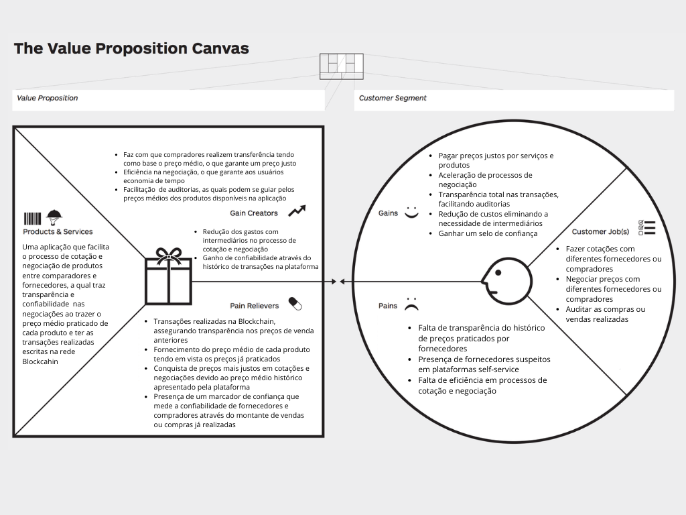</img>
Fonte: Elaborado pelos autores.

&emsp;&emsp;O framework acima representa o Canvas da Proposta de Valor, o qual é utilizado na definição do contexto do cliente e da proposta de valor do produto. No lado do cliente, são apresentadas as Dores (Pains), os Ganhos (Gains) e as tarefas realizadas por este (Customer Jobs), visando mapear a situação atual na qual o cliente se encontra. Já no que diz respeito à proposta de valor, neste quadrante são apresentados os elementos que trazem valor ao cliente tendo em vista as informações expostas no segmento antes apresentado. Neste, encontram-se os analgésicos (Pain Relievers), os produtos e serviços (Products & Services) e os criadores de ganho (Gain Creators). 

&emsp;&emsp;No que diz respeito às tarefas, são as ações atualmente realizadas pelo cliente em seu dia a dia, assim a primeira destas é fazer cotações com diferentes fornecedores ou compradores através da plataforma Ariba. Este processo é realizado manualmente, ou seja, os compradores entram na plataforma e têm acesso aos produtos dos fornecedores, podendo também negociar seus respectivos preços, o que se caracteriza como outra tarefa. Além destes, o cliente também precisa fazer a auditoria de suas compras ou vendas a fim de garantir que durante processos de compra e venda não ocorreram fraudes. 

&emsp;&emsp;Assim, tendo em vista o projeto atualmente desenvolvido para a Alliance, as principais dores dos clientes desta são a falta de transparência do histórico de preços praticados por fornecedores, o que, na prática, pode acarretar em transações onde os fornecedores cobram preços abusivos, diferente dos já praticados, por acreditar que um cliente está disposto a despender mais recursos. Isso é totalmente prejudicial para o cliente, dado que este, ao realizar cotações, não possui certeza se o preço cobrado é justo e, caso não seja, este será financeiramente lesado.  Tal fator também caracteriza o ponto seguinte, o qual se refere à presença de fornecedores suspeitos em plataformas self-service, os quais seriam aqueles plausíveis de cometer atitudes como a supracitada ou até mesmo fraudes em entregas e cobrança de produtos, também caracterizando prejuízo ao cliente. Para além destes, outra dor seria a falta de eficiência em processos de cotação e negociação, dado que atualmente a cotação é requerida pelo cliente a um intermediário, o qual, após receber respostas dos fornecedores, encaminha os valores aos clientes e, somente após isso, as negociações se iniciam. Deste modo, este ainda é um processo moroso, o que interfere diretamente na satisfação do cliente, além de trazer mais gastos na contratação de intermediários para o processo. 

&emsp;&emsp;Logo, os ganhos que serão percebidos pelo cliente através deste projeto são muitos, dentre eles pode-se destacar a compra de produtos por preços justos, dado que a média de preço paga por determinado produto poderá ser acessada, o que diminui a probabilidade de fornecedores cobrarem preços abusivos. Além disso, os processos de negociação podem ser agilizados dado que as negociações já iniciarão em um processo justo, próximo à média já praticada. Outro aspecto importante é a transparência nas transações, isto tendo em mente que os preços de todas as transações de compra e venda serão registradas  na Blockchain - tecnologia utilizada no desenvolvimento do projeto, onde a imutabilidade dos dados inseridos é assegurada - e poderão ser comparados ao preço médio praticado no período. Ademais, com este projeto também se fará possível assegurar que determinado comprador ou fornecedor é confiável devido ao êxito das transações anteriores realizadas por este. Assim, este poderá receber um selo de confiabilidade o qual agrega valor na imagem deste usuário aos outros presentes na plataforma, podendo culminar, até mesmo, em um maior índice de êxitos em fechamento de negócios. 

&emsp;&emsp;No que tange à proposta de valor, como analgésicos, pode-se citar que as transações serão registradas na Blockchain, o que garante sua imutabilidade e transparência, prevenindo assim fraudes. Outro aspecto importante é a garantia de transparência quanto ao preço médio dos produtos, isto sendo calculado a partir do  histórico de preços de venda, o que gera como valor aos compradores maior garantia de preços justos, dado que terão os preços médios como guias do preço atualmente praticado. Além destes, também haverá marcadores de confiança, os quais, baseados nos históricos de transações, serão capazes de medir a confiabilidade de fornecedores e compradores através do montante de vendas ou compras realizadas. 

&emsp;&emsp;No que tange aos criadores de ganho, com a utilização do MVP a ser desenvolvido, tornar-se-á possível para os compradores realizarem transferências tendo como base o preço médio praticado, o que auxilia na obtenção de preços mais justos nas negociações. Além disso, sabendo do preço médio, as negociações possuirão um ponto de partida mais avançado e, por conseguinte, se tornarão mais eficientes ao demandar um volume de tempo menor quando comparado a anteriormente. Para além destes fatores, as auditorias também seriam facilitadas a partir do momento em que as transações estariam registradas de maneira transparente na Blockchain e os preços médios de cada período poderiam ser acessados. Outro ponto importantíssimo é o ganho de confiabilidade através do histórico de transações presente na plataforma, o qual atesta a confiabilidade de determinado usuário.   

&emsp;&emsp;Deste modo, o produto oferecido ao cliente é uma aplicação que facilita o processo de cotação e negociação de produtos entre compradores e fornecedores, a qual traz transparência e confiabilidade nas negociações ao mostrar o preço médio praticado de cada produto e ter as transações realizadas escritas na rede Blockchain. Gerando, desta forma, valor ao cliente ao atender todas as suas dores. 

&emsp;&emsp;Logo, pode-se concluir que este projeto visa atender as dores e questões dos clientes - tal qual apresentados no canvas - a  partir da proposta de valor anteriormente referenciada. Com isto, busca-se criar uma solução que atenda de maneira completa as reais necessidades dos clientes e que possa de fato agregar valor ao parceiro de projeto. 

#### 4.1.5 Matriz de Risco

&emsp;&emsp;A Matriz de Riscos (figura 05 e 06) é uma análise que busca compreender uma maioridade de riscos que permeiam o desenvolvimento do projeto, avaliando seu impacto sobre a produção e a chance de sua ocorrência. Desta maneira, pode-se evitar que problemas futuros acabem por atrapalhar o ambiente de trabalho como um todo.  
&emsp;&emsp;O ezTrack, seguindo os objetivos propostos acima, descreveu abaixo uma Matriz de Riscos que segue sendo progressivamente atualizada. 

 
Figura 02 - Matriz de Riscos - parte 1 
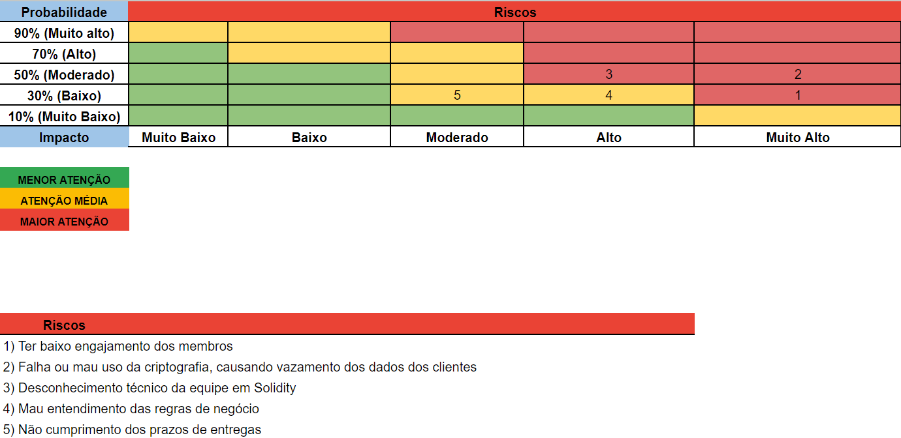</img>
Fonte: Elaborado pelos autores. 

&emsp;&emsp; No que diz respeito aos riscos elencados na Matriz, os quais podem ser visualizados na Figura 02, estes foram posicionados de acordo com seu grau de impacto sobre o grupo, bem como sua respectiva probabilidade de ocorrer. Assim, os riscos com maiores impactos - apresentados como "Muito Alto" na matriz - são: Ter baixo engajamento dos membros e ocorrer falha ou mau uso da criptografia, causando o vazamento dos dados do cliente, os quais, elencamos respectivamente, com baixa e moderada probabilidade de ocorrer. Ambos possuem tal nível de impacto por afetarem diretamente o desenvolvimento pleno do projeto, assim como a satisfação e a segurança dos usuários da plataforma.

&emsp;&emsp; Já no que tange aos fatores de alto risco podem ser citados o desconhecimento técnico da equipe em solidity e o mau entendimento das regras de negócio.  O primiero, é avaliado como tendo probabilidade moderada pois mesmo conhecimentos de Solidity serem abordados ao longo do módulo, devido à alta carga de conteúdos existentes, alguns conceitos podem nebulosos, o que, na visão do grupo,  acarreta na probabilidade já descrita. O segundo, por sua vez, possui probabilidade baixa pois é este que norteia o desenvolvimento da plataforma, por isso, faz-se crucial estar claro a todos os membros do grupo. 

&emsp;&emsp; Por fim, o último fator listado como risco é o descumprimento de prazos de entregas, o qual possui impacto moderado e probabilidade baixa. Tal impacto se daria pela abertura do grupo para com o orientador e o parceiro de projeto para a megociação de prazos que necessitam ser reajustados. Assim, tendo as expectativas alinhadas entre ambos os lados, este não possuiria um alto efeito no grupo. Além disto, sua probabilidade é baixa pois o grupo tem se comprometido e planejado para realizar suas entregas dentro dos prazos estabelecidos a fim de honrar os acordos firmados com os instrutores, o orientador e o parceiro de projeto.

 
Figura 03 - Matriz de Riscos - parte 2  
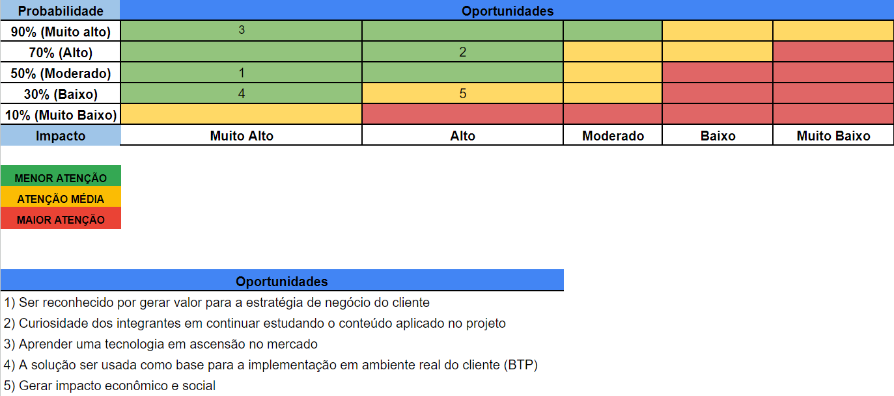</img>
Fonte: Elaborado pelos autores.
 

&emsp;&emsp;No campo das oportunidades, foram avaliadas como tendo impacto muito alto 
aprender uma tecnologia em ascenção no mercado,  ser reconhcecido por gerar valor para a estratégia de negócio do cliente e a solução ser usada para a implementação em ambiente real do cliente (BTP). Isto, pois tais oportunidades são capazes de alavancar o projeto desenvolvido, também como o conhecimento dos integrantes do grupo. As probabilidades das oportunidades aqui citadas são, respectivamente, muito alta, moderada e baixa.

&emsp;&emsp;Ademais, ainda como oportunidades temos a curiosidade dos integrantes em conrtinuar estudando o conteúdo aplicado no projeto e gerar impacto econômico e social. Ambos são listados como tendo alto impacto e com probabilidades, respectivamente, alta e baixa. O primeiro diz respeito à possibilidade dos integrantes do grupo continuarem engajados com o tema da Blockchain e, com isso, se aprimorarem nesta área, já o segundo, tange ao impacto positivo gerado no negócio do parceiro e nas empresas que utilizarão a aplicação, fator que traz mais confiabilidade e proporciona a obtenção de valores mais justos nas compras. 

&emsp;&emsp; Após uma análise cuidadosa dos riscos associados ao projeto de desenvolvimento da aplicação usando blockchain, identificamos várias áreas de preocupação que exigem atenção imediata para garantir o sucesso do projeto. 
&emsp;&emsp; Para mitigar o risco de baixo engajamento dos membros, vamos estabelecer uma rotina de feedback regular, onde os membros da equipe se sintam à vontade para expressar suas preocupações e dificuldades. Além disso, utilizaremos as dailys meetings para discutir o progresso do projeto e abordar quaisquer questões que possam surgir.  
&emsp;&emsp; Para evitar falhas ou mau uso da criptografia, que possam causar vazamento dos dados dos clientes, revisaremos todo o código relacionado à criptografia e validaremos sua implementação com o instrutor Victor Hayashi, especialista em blockchain. 
&emsp;&emsp; Para lidar com o desconhecimento técnico da equipe em Solidity, organizaremos sessões de acompanhamento do que está sendo desenvolvido para a equipe, ministradas pelos membros da equipe com experiência no assunto. Além disso, encorajaremos os membros da equipe a buscar a realização completa dos autoestudos - conteúdo programático das aulas - para aprimorar suas habilidades em Solidity. Para garantir o bom entendimento das regras de negócio, planejaremos e realizaremos sessões de discussão em grupo. Documentaremos as regras de negócio de forma clara e concisa para referência futura, garantindo que todos os membros da equipe tenham acesso às informações necessárias. 
&emsp;&emsp; Por fim, estabeleceremos prazos e datas de revisão claramente definidos para cada fase do projeto, incluindo marcos importantes e entregas específicas. Realizaremos reuniões de acompanhamento regulares (dailys meetings) para avaliar o progresso em relação aos prazos estabelecidos e identificar quaisquer desvios que exijam ação corretiva. Implementaremos medidas de acompanhamento, como a criação de um cronograma visual (Kanban) e o uso de ferramentas de gerenciamento de projetos (Scrum), para garantir que todos os membros da equipe estejam cientes dos prazos e responsabilidades individuais. 
&emsp;&emsp; Este plano de ação será revisado regularmente para garantir sua eficácia na mitigação dos riscos identificados e no sucesso geral do projeto de desenvolvimento da aplicação blockchain. Cada um dos tópicos que mitiga algum risco é delegado periodicamente para um dos membros da equipe, com o objetivo de melhorar a eficiência do acompanhamento dos riscos.
 

#### 4.1.6 Análise Financeira

**Análise Financeira do Projeto**

A análise financeira é indispensável para qualquer projeto, fornecendo um panorama detalhado dos gastos previstos, abrangendo todas as fases, desde a implementação até a manutenção. Essa análise permite uma avaliação minuciosa dos investimentos necessários, facilitando uma alocação de recursos eficiente e um planejamento financeiro estratégico e bem fundamentado. Além disso, enfatiza-se a importância de incluir margens para imprevistos, um elemento crucial para manter a viabilidade e a sustentabilidade financeira do projeto ao longo de seu desenvolvimento e execução. Isso assegura que o projeto possa adaptar-se diante de custos flutuantes e desafios inesperados, reforçando assim sua resiliência e sucesso a longo prazo.

A análise financeira divide-se em categorias principais: os valores associados à implementação da blockchain, englobando custos iniciais e operacionais; a infraestrutura da plataforma, incluindo desenvolvimento e manutenção; e, finalmente, os custos adicionais, que cobrem imprevistos e flutuações de mercado. Esta estrutura assegura uma avaliação compreensiva dos gastos projetados.

### Custos da Blockchain Ethereum:

Na blockchain Ethereum, existe uma unidade de medida denominada “gas”, que determina o custo necessário para executar transações e contratos inteligentes, refletindo a quantidade de recursos computacionais exigidos. Esse mecanismo de taxas assegura a eficiência e segurança da rede, sendo essencial na gestão de projetos que utilizam esta tecnologia.

1. **Deploy do Smart Contract:**
   O Smart Contract precisa ser publicado e ativado na rede blockchain antes de passar a executar suas tarefas, e isso tem um consumo gas. Considerando a funcionalidade e tamanho do nosso contrato, é possível estimar que o deploy custa **1572611 gas**.

2. **Operações do Smart Contract:**
   As operações do contrato inteligente, como cadastro, remoção de usuários, registro e validação de transações, são essenciais. Cada ação consome um gas toda vez que é executada, portanto, esse custo deve ser considerado. Para se ter ideia do quanto será gasto para executar essas ações na blockchain, fizemos uma projeção baseada em uma estimativa exemplar de quantas interações ocorrerão futuramente no sistema que desenvolvemos para a Alliance.
   Para os cálculos de gastos de gas pelas operações, consideramos que 100 empresas fazem parte da rede e que cada uma delas faz 10 operações por mês.
   Normalmente, operações mais simples podem consumir uma média de 20000 gas enquanto as mais complexas podem chegar a 40000. Consideramos a média de 30000 gas para uma operação.
   Contabilizando, teremos um gasto mensal aproximado de **30 milhões de gas**.

**Conversão gas - dólar:**
O gas, na data da produção dessa projeção, possui a média de 65 gwei (1 gwei = 0,000000001 ether, ou seja, 1 bilionésimo de ether). Na mesma data, cada ETH converte a 4.022,95 dólares.
Deste modo, o deploy do contrato, que só ocorre uma vez inicialmente, pode custar **411,22 dólares**, enquanto as operações podem somar um gasto mensal aproximado de **7.844,75 dólares**.

### Custos de Infraestrutura Web2:

Nossa plataforma não se limita apenas à tecnologia blockchain, mas também incorpora um sistema Web2, que inclui frontend, backend e banco de dados, facilitando a interação intuitiva com os usuários. Esta infraestrutura web precisa ser hospedada em servidores confiáveis e requer manutenção regular para garantir segurança e desempenho. Consequentemente, esses aspectos trazem custos adicionais de hospedagem e operação, cruciais para manter a plataforma estável, acessível e funcional para os usuários finais. Portanto, apresentamos a seguir os custos de hospedagem dessa infraestrutura em três serviços de servidor diferentes: AWS, Azure e Google.

**AWS (Amazon Web Services) - AWS Amplify:**

Descrição: AWS Amplify integra serviços de frontend e backend. É uma plataforma como serviço que facilita a configuração de aplicativos completos. Custos calculados seguindo a precificação disponível no site [AWS Amplify Pricing](https://aws.amazon.com/pt/amplify/pricing/).

 **Criação e Implantação:**
- Atualizações por Mês: 60 (equivalente a 2 atualizações por dia).
- Tempo Médio e Custo por Atualização: Cada atualização leva 3 minutos, com um custo de $0.01 por minuto.
- Custo Mensal: 60 atualizações * 3 minutos * $0.01 = $1.80.

 **Hospedagem:**
- Usuários Ativos e Tamanho Médio da Página: 2000 usuários ativos diários com páginas de 1,5 MB.
- GB Servidos por Mês: Calculado com base no número de usuários e tamanho da página, resultando em 87,89 GB aproximadamente.
- Tamanho e Atualizações da Aplicação: Tamanho da aplicação de 50 MB, atualizada 60 vezes por mês, resultando em 2,93 GB armazenados.
- Custos de Hospedagem:
  - GB Servido: $0,15 por GB, totalizando $13,18 para 87,89 GB.
  - GB Armazenado: $0,023 por GB, totalizando $0,07 para 2,93 GB.
  - Custo Mensal de Hospedagem: $13,25 (soma dos custos de GB servidos e armazenados).

 **Custo Total Mensal:**
- Soma dos custos de criação e hospedagem: $1,80 (criação) + $13,25 (hospedagem) = **15,05 dólares.**

**Azure (Microsoft) - Azure App Service:**

Descrição: Azure App Service oferece uma forma integrada de hospedar aplicativos web, backends móveis e APIs RESTful. Custos calculados seguindo a precificação disponível no site [Azure App Service Pricing](https://azure.microsoft.com/pt-br/pricing/details/app-service/windows/).

**Hospedagem (Azure Service Plan B1):**

 Plano de Serviço Básico (B1): 
- Núcleos: 1
- RAM: 1,75 GB
- Armazenamento: 10 GB
- Custo Mensal de Hospedagem: $54,75, baseado em 730 horas de operação por mês.

**Serviços Adicionais:**

 Domínio de Serviço do Aplicativo: 
 - $1,00 (anualizado de $11,99).
- Certificado SSL Padrão: $5,83 (anualizado de $69,99).

**Custo Total Mensal:**

 Custo Mensal Total para Hospedagem e Serviços Adicionais: **61,58 dólares.**

**Google Cloud Platform (GCP) - Google App Engine:**

Descrição: Google App Engine permite construir e hospedar aplicativos web na infraestrutura do Google. Custos calculados seguindo a precificação disponível no site [Google App Engine Pricing](https://cloud.google.com/appengine/pricing?hl=pt-br).

**Hospedagem (Google App Engine - Plano Standard B1):**
- Custo Mensal de Hospedagem: Calculado para uma instância rodando continuamente (730 horas por mês), a $0,0579 por hora, resultando em aproximadamente $42,26 por mês.

**Serviços Adicionais:**
- Tráfego de Saída: $0,139 por GB, considerando uso de 87,89 GB (calculado na projeção da AWS), custo de aproximadamente $12,21.
- Tráfego de Entrada: Gratuito.

**Custo Total Mensal:**

- Custo Mensal Total para Hospedagem e Serviços Adicionais de aproximadamente **54,47 dólares.**	

Independentemente do serviço escolhido, é evidente que cada plataforma oferece seus próprios recursos e custos associados. No entanto, para simplificar a projeção de custos da infraestrutura, consideramos um valor médio dos três serviços mencionados, que é de **43,70 dólares**. Isso garantirá uma abordagem equilibrada e realista ao planejar os gastos relacionados à hospedagem e manutenção da plataforma.

### Imprevistos e Flutuação de Preços:

Além dos custos operacionais previstos, é importante também alocar recursos para lidar com imprevistos e flutuações de preços. Isso abrange variações nos custos de gas da Ethereum e alterações nas taxas de hospedagem web. Essa reserva financeira é crucial para garantir a flexibilidade e estabilidade do projeto, permitindo uma resposta ágil e eficaz a qualquer cenário econômico ou técnico que possa surgir.

A respeito da flutuação de preços, podemos considerar uma taxa de flutuação do aumento do gas em até 200%, observando que ele pode chegar a custar 190 gwei. Observando essa condição, é importante reservar um valor de **15.689,5 dólares** (restante necessário para compensar o aumento em 200% do valor do gas, considerando uma média de $7.844,75)  para caso o preço do gas aumente consideravelmente. Deste modo, no mês da ocorrência, o valor das operações poderá ser coberto independente do aumento.

Outro imprevisto que deve ser considerado é o reajuste do preço do serviço de hospedagem da infraestrutura. Considerando um cenário comum, um reajuste dificilmente ultrapassa 20% de aumento, portanto, é interessante utilizarmos esse número como referência para termos uma reserva segura. Nessa linha de pensamento, a reserva de **104,88 dólares** (20% do preço médio anual dos serviços)  pode assegurar que um contrato de um ano de serviço seja coberto, caso um aumento de até 20% ocorra.

A soma dos valores reservados para imprevistos resulta em **15.794,38 dólares.**

### Conclusão:

Os custos do projeto devem ser divididos em três categorias:
-   Pagamento único: aqueles custos que só são arcados uma única vez;
-   Pagamento recorrente: os custos que devem ser pagos mensalmente;
-   Reserva: valores estimados e reservados para cobrir imprevistos.

No atual projeto, somente um dos custos é de pagamento único, e é referente ao deploy do Smart Contrcat. Seu valor é próximo de 411,22 dólares.
Os pagamentos recorrentes incluem as operações feitas com o Smart Contract para o funcionamento do sistema, estimado em 7.844,75 dólares mensais, e a assinatura do serviço de hospedagem da infraestrutura, que possui a média de 43,70 dólares mensais.  
O total da reserva monetária voltada para o reajuste e a flutuação de preços é de 15.794,38 dólares.

O total dos custos projetados para a implementação do projeto é:

-   **411,22 dólares gastos uma só vez;**
-   **7.888,45 dólares gastos mensalmente;**
-   **15.794,38 dólares reservados.**

#### 4.1.7 Personas 
 
Personas são representações fictícias de segmentos do público-alvo, baseadas em dados reais, usadas no marketing e design de produtos. Estas, ajudam as empresas a compreender melhor seus clientes ideais e a criar produtos, serviços e estratégias de marketing mais direcionados e personalizados.
 
Figura 4 - Persona 1 - Gerente de compras
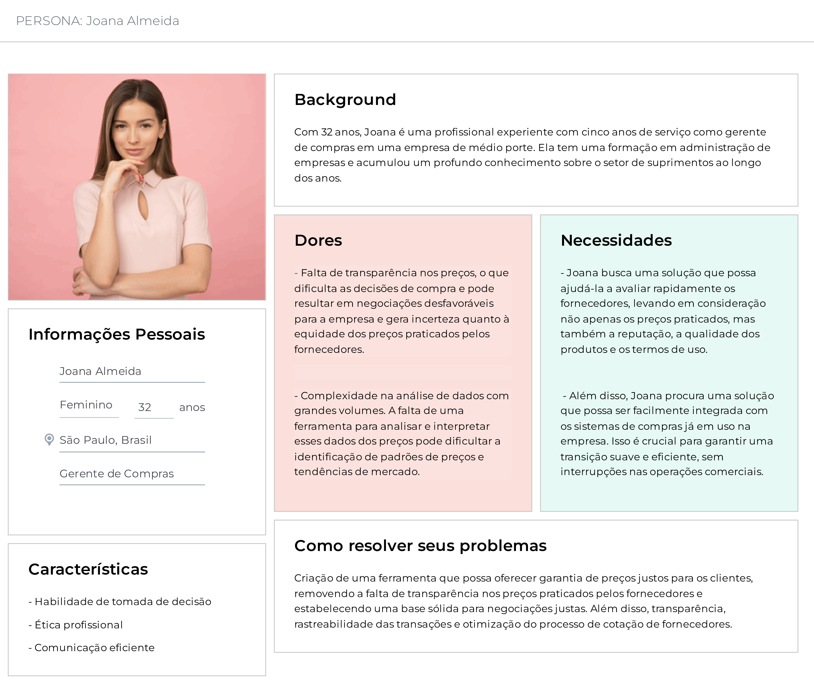</img>
Fonte - Elaborado pelos autores

Figura 5 - Persona 2 - Gerente de vendas
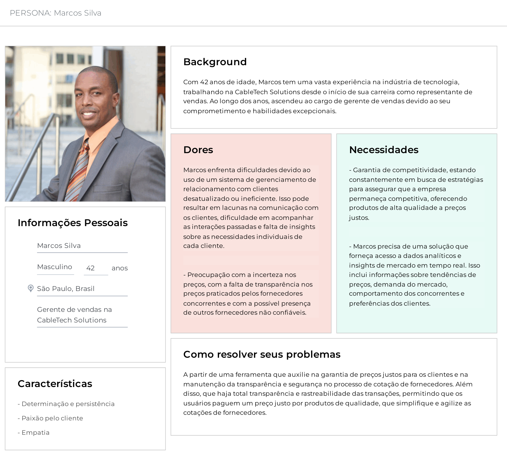</img>
Fonte - Elaborado pelos autores

Figura 6 - Persona 3 - Consultora da Alliance
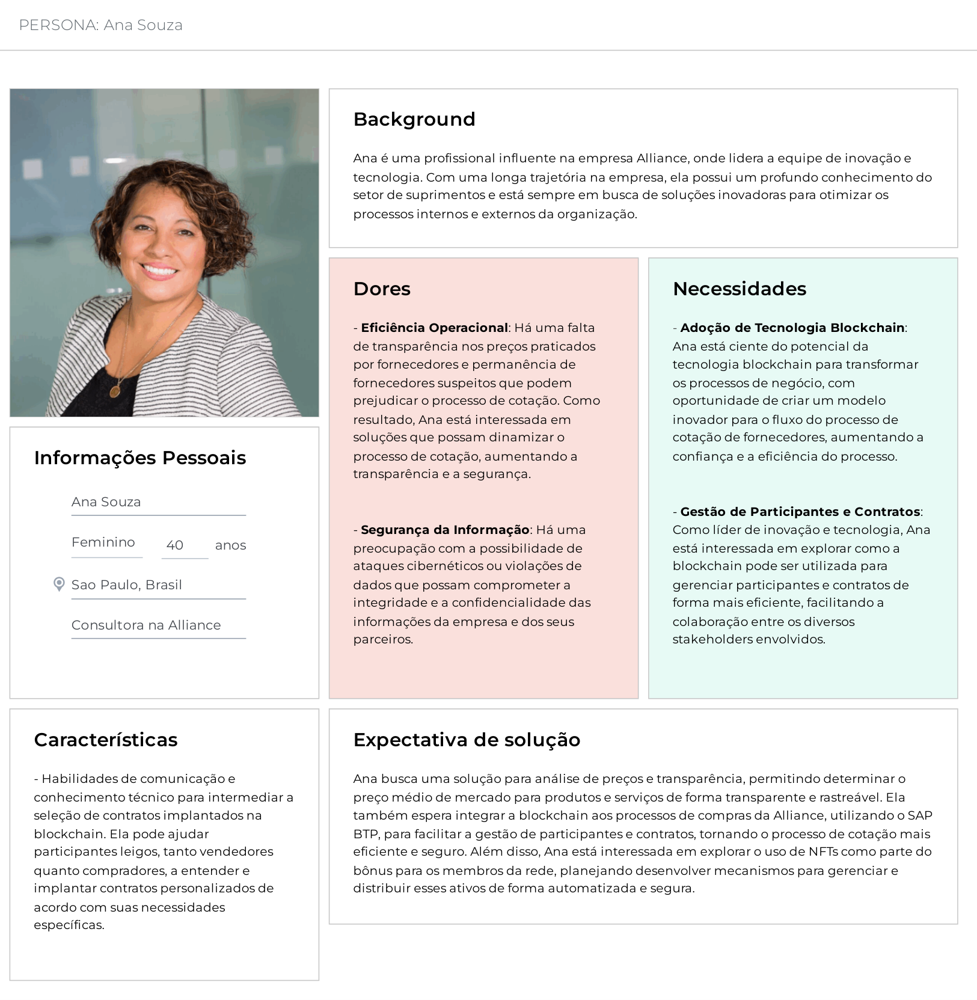</img>
Fonte - Elaborado pelos autores

As personas serão usadas no projeto para compreender as necessidades dos diferentes usuários envolvidos no serviço proposto, incluindo compradores, vendedores e administradores da plataforma. Isso ajudará nossa equipe a desenvolver uma solução mais centrada nos usuários, garantindo uma experiência eficaz para todos os envolvidos.

#### 4.1.8 User Stories

As User Stories, ou Histórias do Usuário, são descrições curtas de necessidades de usuários de um produto, sob seu próprio ponto de vista. Elas buscam descrever essas dores de forma simples, para que a equipe desenvolvedora possa trabalhar nesses requisitos de forma prática e funcional. 

A seguir são apresentadas tabelas que contêm, além das Histórias, descrições com detalhes de critérios que determinam a funcionalidade e como podem ser testados: 

Tabela 1 - Persona 1 - User Story 1

| Categoria             | Dados                                                                                                               |
|-----------------------|---------------------------------------------------------------------------------------------------------------------|
| Número                | 1.1                                                                                                                 |
| Título                | Acessar preço médio de produtos (comprador)                                                                         |
| Personas              | Responsável de compras                                                                                              |
| História              | Eu, como responsável de compras, quero acessar o preço médio de produtos, para ter referência e melhorar a precisão das minhas compras.       |
| Critérios de aceitação | CR-01 - O comprador deve conseguir selecionar o produto específico desejado. CR-02 - O comprador deve conseguir ver o preço médio do produto selecionado. Validação-01: O produto selecionado deve existir. Validação-02: O produto selecionado deve ter um histórico de preços no sistema. |
| Testes de aceitação    | Critério de aceitação: CR-01 a. Comprador seleciona um produto existente que tem histórico no sistema. – O produto é selecionado = correto.  – O produto não é selecionado = errado, deve ser corrigido.  b. Comprador seleciona um produto existente que não tem histórico no sistema.  – O produto é selecionado = correto, mas deve exibir uma mensagem dizendo que o produto ainda não está disponível no sistema.  – O produto não é selecionado = errado, deve ser corrigido.  c. Comprador seleciona um produto não existente.  – O produto é selecionado = errado, deve ser corrigido.  – O produto não é selecionado = correto, deve exibir uma mensagem dizendo que o produto não existe.  Critério de aceitação: CR-02  a. Comprador tenta ver o preço médio de um produto existente que tem histórico no sistema.  – Consegue visualizar = correto.  – Não consegue visualizar = errado, deve ser corrigido.  b. Comprador tenta ver o preço médio de um produto existente que não tem histórico no sistema.  – Consegue visualizar algum número = errado, deve ser corrigido.  – Não consegue visualizar = correto.  c. Comprador tenta ver o preço médio de um produto não existente.  – Consegue visualizar algum número = errado, deve ser corrigido.  – Não consegue visualizar = correto. |

Fonte: Elaborado pelos autores.

Tabela 2 - Persona 1 - User Story 2

| Categoria             | Dados                                                                                                               |
|-----------------------|---------------------------------------------------------------------------------------------------------------------|
| Número                | 1.2                                                                                                                 |
| Título                | Considerar valor da compra no preço médio                                                                           |
| Personas              | Responsável de compras                                                                                              |
| História              | Eu, como responsável de compras, quero que minhas compras sejam registradas na plataforma, para manter atualizado o preço médio.              |
| Critérios de aceitação | CR-01 - As informações de uma compra devem ser registradas no sistema para o cálculo futuro de preços médios. Informações: {Produto, Valor, Unidade de medida, Data, Região, Comprador, Vendedor} |
| Testes de aceitação    | Critério de aceitação: CR-01  a. Uma compra que contém todas as informações é concluída. – As informações são registradas no sistema = correto. – As informações não são registradas no sistema = errado, deve ser corrigido. |

Fonte: Elaborado pelos autores.

Tabela 3 - Persona 1 - User Story 3

| Categoria             | Dados                                                                                                               |
|-----------------------|---------------------------------------------------------------------------------------------------------------------|
| Número                | 1.3                                                                                                                 |
| Título                | Visualizar o distintivo de confiança de um vendedor                                                                 |
| Personas              | Responsável de compras                                                                                              |
| História              | Eu, como responsável de compras, quero verificar se um determinado vendedor é membro da rede de confiança da Alliance, para que eu possa ter segurança de que suas práticas de preços são baseadas em um preço médio confiável. |
| Critérios de aceitação | CR-01 - O comprador deve conseguir ver o distintivo de confiança do vendedor no portal de compras do SAP BTP. Validação: O vendedor deve ser qualificado para receber o distintivo de confiança. |
| Testes de aceitação    | Critério de aceitação: CR-01  a. O comprador acessa, no portal, a página de um vendedor qualificado. – O distintivo é exibido = correto. – O distintivo não é exibido = errado, deve ser corrigido.  b. O comprador acessa, no portal, a página de um vendedor não qualificado. – O distintivo é exibido = errado, deve ser corrigido. – O distintivo não é exibido = correto. |

Fonte: Elaborado pelos autores.

Tabela 4 - Persona 1 - User Story 4

| Categoria             | Dados                                                                                                               |
|-----------------------|---------------------------------------------------------------------------------------------------------------------|
| Número                | 1.4                                                                                                                 |
| Título                | Ver histórico e reputação de um vendedor                                                                            |
| Personas              | Responsável de compras                                                                                              |
| História              | Eu, como responsável de compras, quero ver o histórico de datas de transações de um determinado vendedor, para que eu possa avaliar sua reputação e consistência de suas precificações. |
| Critérios de aceitação | CR-01 - O comprador deve poder visualizar as datas das transações passadas de um vendedor. Validação: O vendedor deve ser membro da rede de confiança da Alliance. |
| Testes de aceitação    | Critério de aceitação: CR-01  a. O comprador acessa a seção que exibe o histórico do vendedor: – As datas de transações são exibidas = correto. – As datas de transações não são exibidas = errado, deve ser corrigido. |

Fonte: Elaborado pelos autores.

Tabela 5 - Persona 2 - User Story 1

| Categoria             | Dados                                                                                                               |
|-----------------------|---------------------------------------------------------------------------------------------------------------------|
| Número                | 2.1                                                                                                                 |
| Título                | Acessar preço médio de produtos (vendedor)                                                                          |
| Personas              | Responsável de vendas                                                                                               |
| História              | Eu, como responsável de vendas, quero acessar o preço médio de produtos, para que possa estabelecer parâmetros de preços competitivos com base nas tendências do mercado. |
| Critérios de aceitação | CR-01 - O vendedor deve conseguir selecionar o produto específico desejado. CR-02 - O vendedor deve conseguir ver o preço médio do produto selecionado. Validação-01: O produto selecionado deve existir. Validação-02: O produto selecionado deve ter um histórico de preços no sistema. |
| Testes de aceitação    | Critério de aceitação: CR-01  a. Vendedor seleciona um produto existente que tem histórico no sistema. – O produto é selecionado = correto. – O produto não é selecionado = errado, deve ser corrigido.  b. Vendedor seleciona um produto existente que não tem histórico no sistema. – O produto é selecionado = correto, mas deve exibir uma mensagem dizendo que o produto ainda não está disponível no sistema. – O produto não é selecionado = errado, deve ser corrigido.  c. Vendedor seleciona um produto não existente. – O produto é selecionado = errado, deve ser corrigido. – O produto não é selecionado = correto, deve exibir uma mensagem dizendo que o produto não existe.  Critério de aceitação: CR-02  a. Vendedor tenta ver o preço médio de um produto existente que tem histórico no sistema. – Consegue visualizar = correto. – Não consegue visualizar = errado, deve ser corrigido.  b. Vendedor tenta ver o preço médio de um produto existente que não tem histórico no sistema. – Consegue visualizar algum número = errado, deve ser corrigido. – Não consegue visualizar = correto.  c. Vendedor tenta ver o preço médio de um produto não existente. – Consegue visualizar algum número = errado, deve ser corrigido. – Não consegue visualizar = correto. |

Fonte: Elaborado pelos autores.

Tabela 6 - Persona 2 - User Story 2

| Categoria             | Dados                                                                                                               |
|-----------------------|---------------------------------------------------------------------------------------------------------------------|
| Número                | 2.2                                                                                                                 |
| Título                | Considerar valor da venda no preço médio                                                                            |
| Personas              | Responsável de vendas                                                                                               |
| História              | Eu, como responsável de vendas, quero que minhas vendas sejam registradas na plataforma, para que o preço médio dos produtos seja atualizado continuamente e eu mantenha minha qualificação para o selo de confiança. |
| Critérios de aceitação | CR-01 - As informações de uma venda devem ser registradas no sistema para o cálculo futuro de preços médios. Informações: {Produto, Valor, Unidade de medida, Data, Região, Comprador, Vendedor} CR-02 - As informações da venda devem ser exibidas na plataforma de administração (Alliance), referenciando o vendedor, para que uma análise de sua qualificação seja feita. |
| Testes de aceitação    | Critério de aceitação: CR-01  a. Uma venda que contém todas as informações é concluída. – As informações são registradas no sistema = correto. – As informações não são registradas no sistema = errado, deve ser corrigido.  Critério de aceitação: CR-02  a. Uma venda é feita. – A venda é exibida referenciando o fornecedor = correto. – As referências de fornecedor não são exibidas = errado, deve ser corrigido. |

Fonte: Elaborado pelos autores.

Tabela 7 - Persona 3 - User Story 1

| Categoria             | Dados                                                                                                               |
|-----------------------|---------------------------------------------------------------------------------------------------------------------|
| Número                | 3.1                                                                                                                 |
| Título                | Acessar histórico de transações para análise                                                                        |
| Personas              | Consultor na Alliance                                                                                               |
| História              | Eu, como consultor na Alliance, quero ter acesso a informações de todas as transações de compra e venda que foram registradas no Blockchain, para que possa administrar o projeto com propriedade. |
| Critérios de aceitação | CR-01 - O consultor deve conseguir acessar a plataforma. CR-02 - O consultor deve conseguir visualizar o histórico das transações. Validação: O usuário deve ter acesso autorizado. |
| Testes de aceitação    | Critério de aceitação: CR-01  a. Um consultor com autorização tenta acessar a plataforma: – A plataforma é acessada = correto. – A plataforma nega o acesso = errado, deve ser corrigido.  b. Um usuário sem autorização tenta acessar a plataforma: – A plataforma é acessada = errado, deve ser corrigido. – A plataforma nega o acesso = correto.  Critério de aceitação: CR-02  a. Um consultor tenta visualizar o histórico de transações. – O histórico é exibido = correto. – O histórico não é exibido = errado, deve ser corrigido. |

Fonte: Elaborado pelos autores.

Tabela 8 - Persona 3 - User Story 2

| Categoria             | Dados                                                                                                               |
|-----------------------|---------------------------------------------------------------------------------------------------------------------|
| Número                | 3.2                                                                                                                 |
| Título                | Gerenciamento dos distintivos de confiança                                                                          |
| Personas              | Consultor na Alliance                                                                                               |
| História              | Eu, como consultor na Alliance, quero poder gerenciar a emissão e remoção de distintivos de confiança de clientes, para manter a integridade da rede de confiança. |
| Critérios de aceitação | CR-01 - O consultor deve conseguir emitir e remover distintivos de confiança de empresas da rede. Validação: O usuário deve ter acesso autorizado. |
| Testes de aceitação    | Critério de aceitação: CR-01  a. Um consultor com autorização tenta emitir ou remover distintivos: – O status de posse do distintivo é atualizado = correto. – O status de posse do distintivo não é atualizado = errado, deve ser corrigido.  b. Um usuário sem autorização tenta emitir ou remover distintivos: – O status de posse do distintivo é atualizado = errado, deve ser corrigido. – O status de posse do distintivo não é atualizado = correto. |

As User Stories e outras informações apresentadas na tabela acima poderão servir como um guia de funcionalidades para o desenvolvimento do projeto da ezTrack. Apesar de nem todas as necessidades dessas histórias estarem no escopo do MVP, as levamos em consideração durante as reuniões de planejamento. Vale ressaltar, também, que essas tabelas serão consultadas em todas as Sprints, pois recordam de modo ágil quais são alguns dos requisitos necessários. 

### 4.2. Qualidade de Sistemas

#### 4.2.1 Análise de Risco

&emsp;&emsp;A implementação da tecnologia blockchain em um ambiente de contratação de fornecedores traz consigo diversas oportunidades, mas também apresenta desafios e riscos significativos. Ao considerarmos a segurança da informação nesse contexto, é fundamental analisar os requisitos de segurança, as vulnerabilidades existentes, os possíveis atacantes, os ataques potenciais, a priorização desses ataques e a descrição de requisitos de segurança específicos para o cenário de aplicação. É por isso que realizamos a análise de risco, um processo no qual se investiga determinadas ameaças e a probabilidade de que aconteçam, investigando meios para evitar que ocorram ou atenuar os possíveis impactos.

&emsp;&emsp;Os requisitos de segurança relevantes para essa implementação incluem a integridade e confidencialidade das transações na blockchain, garantindo que os registros de valores acordados permaneçam íntegros e protegidos contra acesso não autorizado. Ademais, a irretratabilidade e a autenticidade também são requisitos fundamentais para garantir a segurança dos dados. Esses dados a serem registrados no blockchain devem incluir as transações de cotações de produtos, contendo informações detalhadas, como o nome do produto, data, preço, quantidade e unidade de medida. É essencial ressaltar que os dados dos players envolvidos serão anonimizados para proteger a privacidade e a confidencialidade dos participantes.

&emsp;&emsp;Inicialmente, duas vulnerabilidades foram identificadas como possibilidades de ataque: “ataques de 51%” e falhas nos contratos inteligentes. Porém, conforme o projeto é desenvolvido e a rede blockchain evolui, é possível que alguma fragilidade do sistema seja identificada, assim como as vulnerabilidades já apontadas serão mitigadas ao máximo.

&emsp;&emsp;Os ataques de 51% comprometem a integridade da blockchain, nesse tipo de ataque, um único ator ou grupo de atores controla mais de 50% do poder de computação da rede, o que lhes permite invalidar transações anteriores e até mesmo reverter transações confirmadas. Para evitar um ataque de 51%, é fundamental que a rede blockchain seja suficientemente descentralizada, com uma distribuição ampla do poder de computação entre os participantes. Além disso, mecanismos de consenso robustos, como o Proof of Work (PoW) ou Proof of Stake (PoS), podem ajudar a proteger a rede contra esse tipo de ataque ao tornar economicamente inviável para um ator malicioso controlar a maior parte do poder de computação. 

&emsp;&emsp;Os potenciais atacantes nesse cenário incluem hackers motivados por ganho financeiro e competidores maliciosos em busca de vantagem competitiva. Estes, podem realizar diversos ataques, como, além do controle de 51% do poder de computação da rede, a exploração de vulnerabilidades nos contratos inteligentes e a manipulação de transações.

	

&emsp;&emsp;As falhas nos contratos inteligentes representam outra vulnerabilidade significativa, pois podem ser exploradas por atacantes para manipular operações e comprometer a segurança da rede.
No nível da blockchain, as vulnerabilidades dos contratos inteligentes podem incluir a falta de verificação de autenticidade dos contratos, permitindo que contratos maliciosos sejam implantados na rede. Já no nível do Solidity, a linguagem de programação utilizada para escrever contratos inteligentes na blockchain Ethereum, as vulnerabilidades podem envolver falhas de programação, como reentrância, overflow/underflow de inteiros, entre outras.

&emsp;&emsp;Ainda, um terceiro possível ataque relevante a ser considerado é o Ataque de Negação de Serviço Distribuído (DDoS, do inglês Distributed Denial of Service). Esse tipo de ataque sobrecarrega a rede blockchain com um volume excessivo de tráfego, tornando-a inacessível para os usuários legítimos. Os atacantes podem usar botnets ou outros meios para coordenar e lançar ataques DDoS contra os nós da rede, prejudicando sua disponibilidade e comprometendo o funcionamento normal das operações. Além disso, no contexto específico deste projeto, os atacantes podem tentar sobrecarregar a rede com "pacotes de dados maliciosos", impactando não apenas o funcionamento da blockchain, mas também afetando o valor médio final que seria gerado, um dos principais objetivos deste produto. 

&emsp;&emsp;A manipulação de transações pode ocorrer em conjunto com o ataque de 51% ou como um ataque separado. Enquanto o ataque de 51% visa controlar a maioria do poder de computação da rede para invalidar ou reverter transações, a manipulação de transações envolve a modificação de transações legítimas para beneficiar o atacante. Esse tipo de ataque pode ser realizado por meio da exploração de vulnerabilidades nos contratos inteligentes ou do comprometimento de chaves privadas de usuários autorizados. Sendo assim, a autenticação dessas transações e a criptografia de chaves privadas são indispensáveis também, para manter a integridade da rede e protegê-la dessa espécie de ataque.

&emsp;&emsp;Assim, é importante que haja um direcionamento das medidas de proteção da rede, conforme a priorização dos ataques identificados. Para mitigar esses riscos, são necessárias medidas de segurança robustas, como a implementação de protocolos de consenso mais seguros e a realização de auditorias regulares nos contratos inteligentes. Além disso, é importante realizar monitoramento contínuo da rede para detectar e responder rapidamente a possíveis ameaças.

Tabela de Priorização dos Ataques

| Ataque                             | Impacto | Probabilidade | Risco |
|------------------------------------|---------|---------------|-------|
| Ataque de 51%                      | Alto    | Médio         | Alto  |
| Ataque de DDoS                     | Alto    | Médio         | Alto  |
| Manipulação de Transações          | Alto    | Baixo         | Alto  |
| Exploração de Vulnerabilidades de Smart Contracts | Médio | Médio | Médio |

Fonte: Elaborado pelos autores.

&emsp;&emsp;Para justificar os níveis de impacto, probabilidade e risco atribuídos aos ataques identificados, consideramos os seguintes pontos:

#### &emsp;Ataque de 51%:

- Impacto: Alto, já que ataque compromete a integridade da blockchain, permitindo a invalidação e reversão de transações confirmadas. Isso pode causar danos significativos à confiabilidade e ao funcionamento da rede.
- Probabilidade: Média, pois depende da concentração de poder de computação dos participantes da rede.
- Risco: Alto, devido ao impacto significativo e à viabilidade técnica do ataque.

#### &emsp;Ataque de DDoS:

- Impacto: Alta, pois sobrecarrega a rede com tráfego excessivo, tornando-a inacessível para usuários legítimos e comprometendo sua disponibilidade.
- Probabilidade: Média, considerando a possibilidade de coordenar e lançar ataques DDoS.
- Risco: Alto, devido à interrupção do serviço e ao potencial impacto negativo nas operações.

#### &emsp;Manipulação de Transações:

- Impacto: Alto, porque a modificação de transações legítimas para beneficiar o atacante compromete a integridade da rede.
- Probabilidade: Baixa, devido à necessidade de acesso às chaves privadas ou à exploração de vulnerabilidades nos contratos inteligentes.
- Risco: Alto, considerando o impacto significativo na confiança dos usuários e na segurança das transações.

#### &emsp;Exploração de Vulnerabilidades de Smart Contracts:

- Impacto: Médio, já que pode comprometer a segurança da rede e permitir a execução de contratos maliciosos.
- Probabilidade: Média, dependendo da presença de vulnerabilidades e da eficácia das auditorias de segurança.
- Risco: Médio, pois representa uma ameaça potencial à integridade e ao funcionamento dos contratos inteligentes.

&emsp;&emsp;Ao considerar esses fatores, podemos entender melhor os riscos associados a cada tipo de ataque e direcionar os esforços de segurança de acordo com sua prioridade e gravidade. 

 
Figura 07 - Mapeamento das Vulnerabilidades 
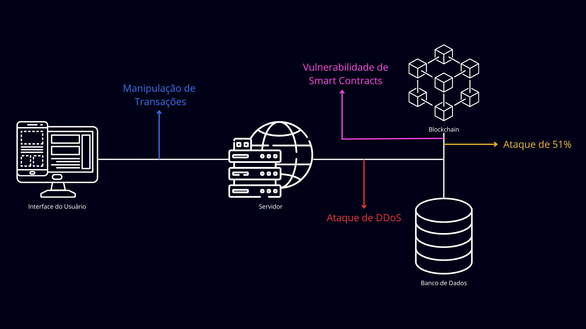</img>
Fonte: Elaborado pelos autores.

&emsp;&emsp;A partir dessa imagem, que constitui em uma arquitetura de alto nível, ou seja, um diagrama que apresenta os principais componentes de um sistema, é possível identificar os momentos em que os possíveis ataques levantados ocorreriam, corroborando com o mapeamento de um plano de ação para reduzir seus impactos e/ou evitá-los.

&emsp;&emsp;Em resumo, a implementação da tecnologia blockchain em um ambiente de registro de valores acordados oferece benefícios significativos, mas também apresenta desafios de segurança. Ao identificar e preparar a rede para esses possíveis riscos, operando para mitigá-los, o mercado receberá diversos benefícios garantidos por essa tecnologia.

#### 4.2.2 Análise da Norma ISO 25010

&emsp;&emsp;As normas ISO/IEC 25000, também conhecidas por SQuaRE (Software Product Quality Requirements and Evaluation), são um conjunto de regulamentos que certificam a qualidade de um produto ou sistema de software. Mais especificamente, a ISO/IEC 25010 reúne um quadro de requisitos não-funcionais modelo para qualificá-los.

&emsp;&emsp;Essa norma é importante pois oferece um guia de critérios e diretrizes que corroboram com uma boa construção ao longo do ciclo de vida do desenvolvimento de um produto. Então, para avaliar este projeto, serão considerados três principais requisitos: a compatibilidade, a segurança e a flexibilidade (ou portabilidade).

&emsp;&emsp;A começar pela compatibilidade, esse critério analisa o grau de troca e benefício de informações de um sistema para com outro (interoperabilidade), e/ou a execução de funções entre sistemas que compartilham o mesmo ambiente de forma eficiente, sem prejudicar outro produto (coexistência).

&emsp;&emsp;No projeto de blockchain em questão, a adaptação do ambiente de execução da Ethereum Virtual Machine (EVM) para a Crypto Virtual Machine (CVM) foi realizada para melhorar a compatibilidade e integração entre o frontend e o backend da blockchain, facilitando a interoperabilidade e comunicação entre os sistemas. 

&emsp;&emsp;Seguindo para segurança, esse é composto por quatro subcaracterísticas: a confidencialidade, que garante o acesso de dados somente àqueles autorizados; a integridade, que assegura os dados contra modificações ou exclusões não autorizadas; o não repúdio, que prova a ocorrência de um certo evento, sem que esse possa ser negado posteriormente; a responsabilidade, que atribui ações de uma entidade somente à essa entidade; a autenticidade, que comprova a identidade do que foi reivindicado; e a resistência, que assegura o acesso e as operações de um sistema mesmo sob ataque.
 

&emsp;&emsp;Em relação à segurança no projeto, foram considerados os pontos de confidencialidade para garantir o acesso controlado aos dados, integridade para evitar modificações não autorizadas, autenticidade para confirmar identidades, e resistência a ataques, como os ataques de 51%, que foram analisados em uma abordagem de análise de risco.

&emsp;&emsp;Por fim, a flexibilidade aborda o nível em que um produto pode adaptar a alterações nos requisitos do próprio sistema, contexto de utilização ou ambiente. A adaptabilidade, como o significado da própria palavra, condiz com o grau de eficiência de um produto ao ter transmutado para diferentes softwares, hardwares e ambientes; a escalabilidade diz respeito à modificação conforme variabilidade, seja por crescentes ou decrescentes no sistema; a instabilidade é a eficácia ao se instalar ou desinstalar o produto no ambiente desejado; e a substituibilidade, o ponto em que o produto pode substituir outro de mesma finalidade.
 

&emsp;&emsp;A flexibilidade do projeto é crucial quando se trata de sua habilidade em se adaptar a mudanças nos requisitos do sistema e nos ambientes de execução. Um ponto crítico de avaliação é a adaptabilidade do sistema ao migrar de uma máquina virtual para outra, mantendo a integridade e o desempenho dos contratos inteligentes. Além disso, é necessário considerar o trilema da escalabilidade, que aborda o desafio de equilibrar a descentralização, segurança e escalabilidade em sistemas blockchain. A escalabilidade do sistema para lidar com volumes crescentes de transações é vital, mas deve ser gerenciada cuidadosamente para evitar comprometer a descentralização ou a segurança. A substituibilidade também é essencial, garantindo que versões antigas possam ser substituídas por novas sem interrupções significativas, mantendo a continuidade e evolução do sistema de forma eficiente.

&emsp;&emsp;Logo, baseado no que foi constatado acima, é importante levar em consideração os requisitos da norma, não somente no planejamento, como no decorrer do desenvolvimento de um produto ou sistema, para assim garantir a manutenção da qualidade daqui que será ou está sendo elaborado. 

#### 4.2.3 Redução de _Gas Fee_

&emsp;&emsp; Para começar esse tópico, é importante deixar claro o que significa o termo “gas fee”. Em tradução livre, correspondendo à “taxa de gasolina”, é usado para metrificar o poder computacional necessário para realizar as transações dentro de um sistema, ou seja, o combustível que a máquina precisa para executar uma tarefa. Portanto, quanto maior o esforço, maior o gas, e maior o custo! 

&emsp;&emsp; Além disso, é necessário citar o ambiente de teste no qual as imagens da redução do gas foram retiradas. O "playground" da Ethereum permite que os usuários podem escrever e testar código EVM diretamente no navegador, verificando como os smart contracts estão funcionando. 

&emsp;&emsp; Após uma refatoração da primeira versão do código dos smart contracts em Solidity, o gas diminuiu em cerca de 25%, como é possivel observar nas imagens abaixo, no canto superior direito. 

 
Figura 08 - Valor do gas na Primeira Versão do Contrato. 
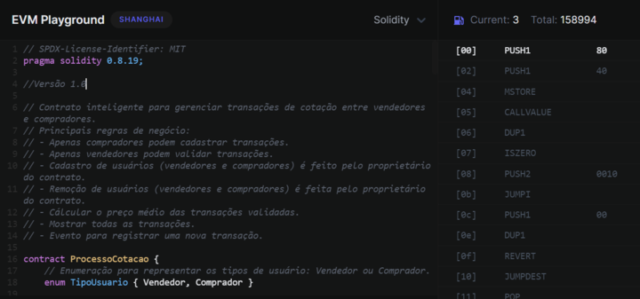</img>
Fonte: Elaborado pelos autores.

 

 
Figura 09 - Valor do gas Após Refatoração do Contrato. 
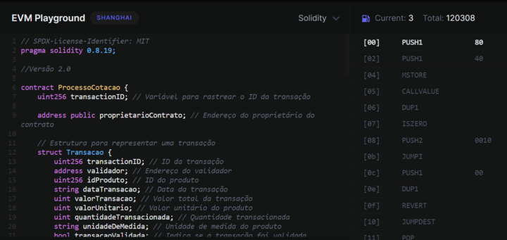</img>
Fonte: Elaborado pelos autores.

&emsp;&emsp; Em consideração final, a redução de gas no contrato  não apenas melhorou a eficiência operacional, mas também resultou em uma redução substancial nos custos totais do projeto (mais detalhes de custo podem ser consultados na análise financeira, presente nesse mesmo documento). Essa abordagem não apenas atendeu aos requisitos técnicos e de desempenho do contrato, mas também garantiu uma melhor experiência para os usuários finais, promovendo a confiabilidade e a robustez do sistema como um todo.

## 5. Solução Proposta

### 5.1 Regras de Negócio

As regras de negócio são fundamentais para o desenvolvimento de um projeto. Elas asseguram que o produto atenda aos requisitos do mercado e aos objetivos estabelecidos pela empresa. Ao definir padrões e critérios claros, as regras de negócio não apenas otimizam o processo de desenvolvimento, garantindo eficiência e eficácia, mas também ajudam na manutenção da relevância do produto em um mercado competitivo, maximizando seu valor para os clientes. A imagem abaixo traz uma tabela detalhada para as regras de negócio desenvolvidas para o nosso produto em desenvolvimento.

 
Figura 10 - Tabela descritiva das regras de negócio 
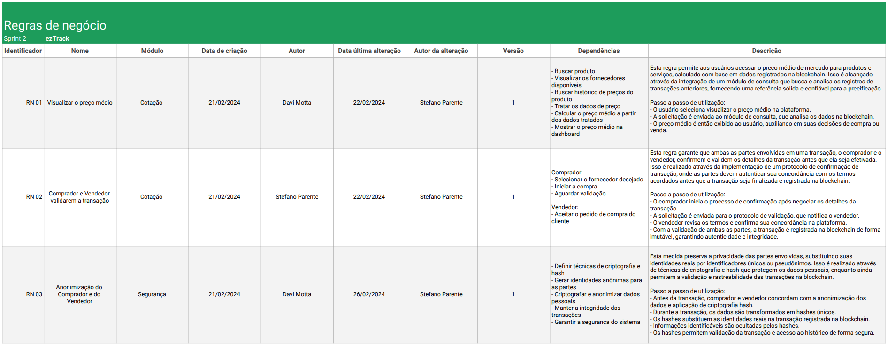</img>
Fonte: Elaborado pelos autores.

### 5.2 Diagrama de Blocos

&emsp;&emsp;Um dos recursos mais utilizados na representação de sistemas é o diagrama de blocos. Este tipo de diagrama fornece uma visualização clara dos componentes de um sistema e dos relacionamentos entre eles. Ao mostrar como um sistema opera internamente, o diagrama de blocos facilita a compreensão da organização e da funcionalidade do conjunto. Mediante a utilização de diferentes blocos e suas interconexões, é possível demonstrar de maneira eficaz a estrutura e o funcionamento do sistema em questão. 

 
Figura 11 - Diagrama de Blocos 
</img>
Fonte: Elaborado pelos autores.

### 5.3 Diagramas de Sequência UML

&emsp;&emsp; Diagramas de sequência UML (Linguagem de Modelagem Unificada) são muito úteis para modelar e entender sistemas interativos. Eles ajudam a mapear interações entre diferentes objetos (partes de um sistema) em um determinado caso de uso, mostrando a ordem desses eventos e suas funções. São muito utilizados tanto por desenvolvedores quanto por profissionais de negócios para analisar requisitos de sistemas novos ou para documentar processos existentes.

&emsp;&emsp; A estrutura de um diagrama de sequência é apresentada como uma linha do tempo vertical, onde cada objeto envolvido na interação tem sua própria coluna. As mensagens trocadas entre esses objetos são representadas por setas. Os diagramas podem ser representados de modo simples ou mais complexo, dependendo do grau de detalhamento desejado. Em geral, os diagramas mais completos apresentam diferentes tipos de setas, que podem ser síncronas, quando o remetente espera uma resposta antes de prosseguir, ou assíncronas, para indicações de processos independentes. Além disso, incluem elementos como barras de ativação e variados tipos de linhas de vida, como entidade, fronteira e controlador. Esses detalhes adicionam camadas ao diagrama e definem o papel de cada objeto no sistema: entidade para elementos de dados, fronteira para interfaces de usuário e controlador para elementos que coordenam interações entre outros.

A seguir, serão apresentados os quatro diagramas de sequência UML referentes aos principais processos do sistema desenvolvido pela ezTrack:

- Diagrama de Sequência Login MetaMask
- Diagrama de Sequência Registrar Compra
- Diagrama de Sequência Confirmar Venda
- Diagrama de Sequência Visualizar Preço Médio

Para cada um dos diagramas, além da representação imagética exibida, disponibilizamos também uma versão codificada em D2lang, que pode ser interpretada no [D2 Playground](https://play.d2lang.com/?script=FMqxrQIxEATQ_Fcxup-iC2jhoJCVd2QNsll81hJQEiklXGOI_P1ji0bYSCFQjo-rBi5neMBldbducGJy5PG-FxlGEs7Jm-Gpmdb0sn3FtWOyptxOKE0_xY5li_5Q47L-fQMAAP__&).

 
Figura 12 - Diagrama de Sequência Login MetaMask  
</img> 
Fonte: Elaborado pelos autores.  
<a href=https://github.com/Inteli-College/2024-T0010-SI05-G01/blob/dev/src/sequence_diagrams_d2lang/DiagramaSequênciaLoginMetaMask.d2 >Sua versão em código D2 pode ser acessada aqui </a>

&emsp;&emsp; Este diagrama de sequência descreve o processo pelo qual um usuário, seja um comprador ou um vendedor, realiza o login na plataforma utilizando o plugin MetaMask. O usuário inicia o processo de autenticação através do plugin, que verifica a autoridade do usuário para acessar a plataforma. Se o MetaMask confirmar a autorização do usuário, ele é informado de que a autenticação foi bem-sucedida, permitindo-lhe então acessar a plataforma. Caso a autenticação não seja confirmada pelo plugin, o usuário recebe uma notificação de falha, e o acesso à plataforma é consequentemente negado. Por mais que seja um processo simples, é crucial para o funcionamento íntegro do projeto, pois o mesmo visa a segurança e integridade.

 
Figura 13 - Diagrama de Sequência Registrar Compra  
</img> 
Fonte: Elaborado pelos autores.  
<a href=https://github.com/Inteli-College/2024-T0010-SI05-G01/blob/dev/src/sequence_diagrams_d2lang/DiagramaSequênciaRegistrarCompra.d2 >Sua versão em código D2 pode ser acessada aqui </a>

&emsp;&emsp;Este diagrama ilustra o processo pelo qual um comprador registra uma recente transação de compra na plataforma. Após se autenticar, o comprador inicia o registro da transação ocorrida. Isso envolve preencher um formulário na plataforma com os detalhes da transação (comprador, fornecedor, produto, unidade de medida, quantidade, valor, região e data). Uma vez que o formulário é submetido, a plataforma processa as informações e solicita uma confirmação da outra parte envolvida, que seria o vendedor. Só após a confirmação do vendedor, a transação será registrada no blockchain (como descrito no próximo diagrama).

 
Figura 14 - Diagrama de Sequência Confirmar Venda  
</img> 
Fonte: Elaborado pelos autores.  
<a href=https://github.com/Inteli-College/2024-T0010-SI05-G01/blob/dev/src/sequence_diagrams_d2lang/DiagramaSequênciaConfirmarVenda.d2 >Sua versão em código D2 pode ser acessada aqui </a>

&emsp;&emsp; Este diagrama descreve o procedimento pelo qual uma venda é confirmada após uma transação ser registrada pelo comprador. Inicialmente, o vendedor autentica-se usando o MetaMask. A plataforma então solicita a confirmação do vendedor sobre a venda. Uma vez que o vendedor confirma a venda, a informação é passada para o servidor e, subsequentemente, a transação é registrada no blockchain. Este processo sublinha a importância da confirmação do vendedor para a conclusão da transação e a segurança fornecida pelo registro no blockchain.

 
Figura 15 - Diagrama de Sequência Visualizar Preço Médio  
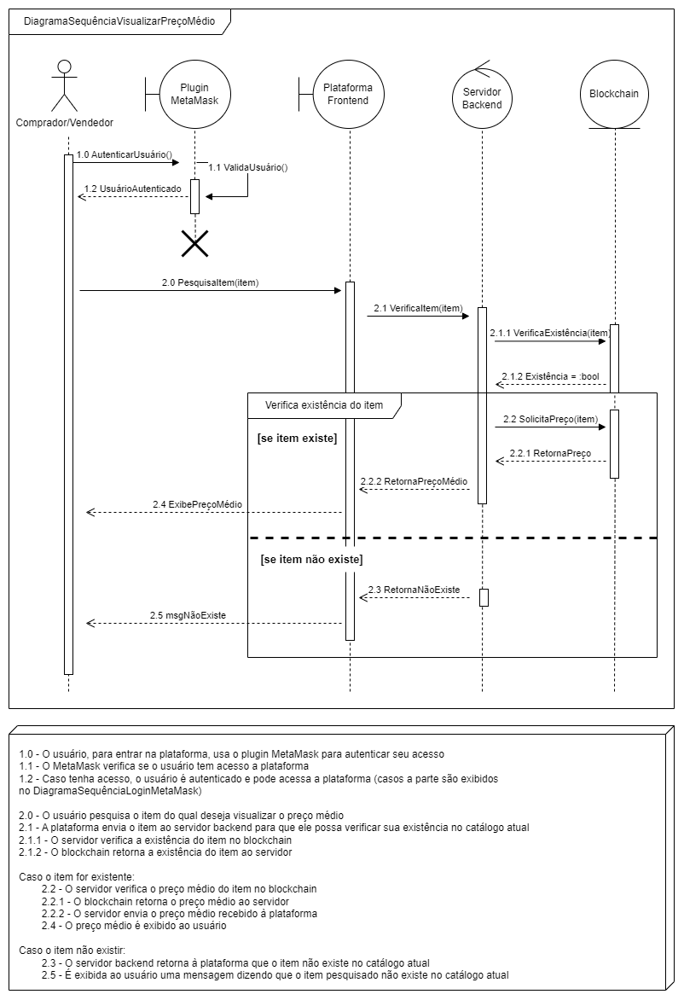</img> 
Fonte: Elaborado pelos autores.  
<a href=https://github.com/Inteli-College/2024-T0010-SI05-G01/blob/dev/src/sequence_diagrams_d2lang/DiagramaSequênciaVisualizarPreçoMédio.d2 >Sua versão em código D2 pode ser acessada aqui </a>

&emsp;&emsp; Este diagrama explica como um usuário pode visualizar o preço médio de um item na plataforma. Após a autenticação via MetaMask, o usuário pode pesquisar um item específico. A plataforma, com a ajuda do servidor backend e do blockchain, verifica a existência do item e, se existir, consulta e retorna o preço médio do item. Se o item não existir, uma mensagem é exibida ao usuário. Este processo demonstra a interação mais importante da plataforma, possibilitando, finalmente, que o preço médio obtido por registros de transações anteriores seja exibido ao usuário, de modo seguro e transparente.

&emsp;&emsp; Os quatro diagramas de sequência apresentados são cruciais para o presente projeto, não apenas por fornecerem uma descrição minuciosa dos processos do sistema, mas também por oferecerem suporte vital para as estratégias de implementação e desenvolvimento. Eles facilitam uma compreensão profunda das interações sistemáticas e das sequências de operação, essenciais para a modelagem eficaz e a realização das metas.

###  Planejamento da Integração

Planejar a integração do sistema é fundamental, pois além de esclarecer o trabalho de desenvolvimento, apresenta ao parceiro de projeto como as diferentes partes do sistema irão se comunicar e funcionar juntas de maneira coesa. Essa etapa é crucial para identificar os requisitos técnicos e estabelecer um entendimento mútuo entre todas as partes envolvidas. Ao visualizar a interação entre os componentes, como ilustrado no diagrama de sequência, podemos garantir uma implementação eficaz que atenda tanto às necessidades operacionais quanto às expectativas de desempenho.

 
Figura 16 - Diagrama de Sequência Processamento Integração  
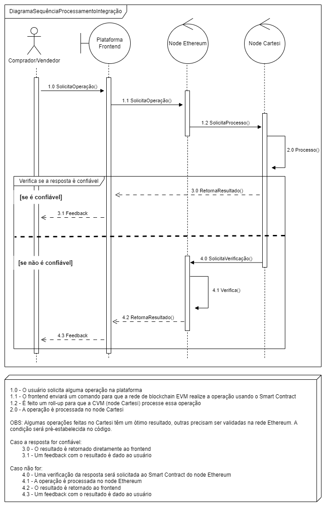</img> 
Fonte: Elaborado pelos autores.  
<a href=https://github.com/Inteli-College/2024-T0010-SI05-G01/blob/dev/src/diagramas/DiagramaSequênciaProcessamentoIntegração.d2 >Sua versão em código D2 pode ser acessada aqui </a>

&emsp;&emsp; O diagrama acima descreve o como é o processo de forma geral das solicitações feitas pelos usuários. Inicialmente, o usuário faz uma solicitação pelo frontend da plataforma. Em seguida, essa solicitação é enviada à rede blockchain da Ethereum, para, posteriormente, ser encaminhada para processamento no node da Cartesi. Dependendo da confiabilidade da resposta (pré-estabelecido no código), o retorno pode ser direto ao frontend ou será antes feita uma verificação adicional no node da Ethereum. Em seguida, um feedback é exibido ao usuário.

&emsp;&emsp; Optamos por integrar o sistema desse modo, pois processar a informação na máquina virtual da Cartesi e não diretamente na do Ethereum traz diversas vantagens. As principais são a economia de gas (custo para processar os dados), maior capacidade para processar programas e a diversa variedade de linguagens que podem ser utilizadas, facilitando atualizações futuras. Assim, o sistema da ezTrack se torna muito mais adequado em diversos aspectos.

## 7. Referências

ARTBACKUP. Entenda sobre análise de risco na segurança da informação. [S. l.], 2021. Disponível em: https://www.artbackup.com.br/protecao-de-dados/analise-de-risco-na-seguranca-da-informacao-entenda-os-principais-conceitos-2/. Acesso em: 12 fev. 2024.

CONCEITO.DE. Diagrama de blocos - O que é, conceito e definição.[S. l.], 21 jul. 2020. Disponível em: https://conceito.de/diagrama-de-blocos. Acesso em: 03 mar. 2024.

GEEKSFORGEEKS. DDoS in Blockchain. [S. l.], 16 ago. 2022. Disponível em: https://www.geeksforgeeks.org/ddos-in-blockchain/. Acesso em: 12 fev. 2024.

IMMUNEBYTES. Explained: Overflow And Underflow Vulnerability in Smart Contracts. [S. l.], 20 mar. 2023. Disponível em: https://www.immunebytes.com/blog/explained-overflow-and-underflow-vulnerability-in-smart-contracts/. Acesso em: 13 fev. 2024.

MCSHANE, Griffin. What Is a 51% Attack?. [S. l.], 11 maio 2023. Disponível em: https://www.coindesk.com/learn/what-is-a-51-attack/#:~:text=A%2051%25%20attack%2C%20also%20known,power%20from%20a%20third%20party. Acesso em: 12 fev. 2024.

OTMANI, Redouane. Smart Contracts Vulnerabilities. [S. l.], 28 nov. 2022. Disponível em: https://medium.com/coinmonks/smart-contracts-vulnerabilities-abbd6185252a. Acesso em: 12 fev. 2024.

QUIGLEY, John L.; GILBERT, John. What Is Proof-of-work (PoW)? All You Need to Know. [S. l.], 24 abr. 2023. Disponível em: https://blockworks.co/news/what-is-proof-of-work. Acesso em: 13 fev. 2024.

WEB3SEC .O que Você Precisa Saber Sobre os Ataques de Reentrância por Contratos Inteligentes. [S. l.], 22 fev. 2023. Disponível em: https://pt.w3d.community/devaraujo/o-que-voce-precisa-saber-sobre-os-ataques-de-reentrancia-por-contratos-inteligentes-e73. Acesso em: 13 fev. 2024.
