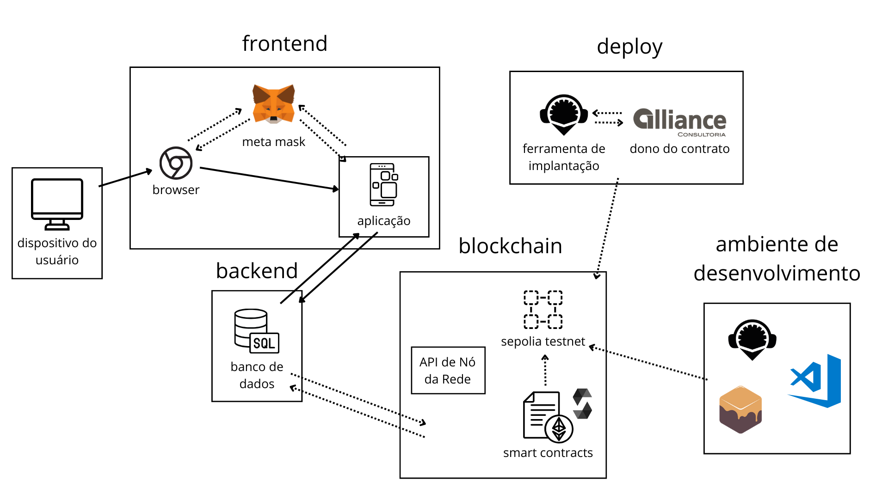
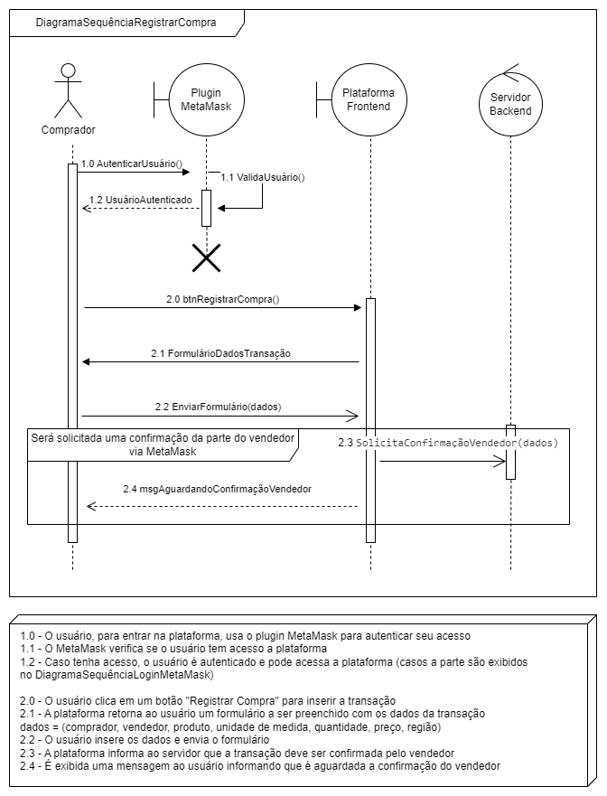

# Inteli - Instituto de Tecnologia e Liderança 

  

# Aplicações em Blockchain

## ezTrack

## 🚀 Integrantes:

- <a href="https://www.linkedin.com/in/danielzular/">Daniel Zular</a>
- <a href="https://www.linkedin.com/in/davi-motta/">Davi Motta</a>
- <a href="https://www.linkedin.com/in/luizarsantana/">Luiza Santana</a>
- <a href="https://www.linkedin.com/in/mateus-mar%C3%A7al-212953264/">Mateus Marçal</a>
- <a href="https://www.linkedin.com/in/omatheusrsantos/">Matheus Ribeiro dos Santos</a>
- <a href="https://www.linkedin.com/in/stefano-parente-652822244/">Stefano Parente</a>

## 📁 Estrutura de pastas

|--> assets 
  &emsp;| --> imagens  
  &emsp;| --> videos  
  &emsp;|--> readme.md 
|--> docs 
  &emsp;| --> apresentações  
  &emsp;| --> documentacao.md  
  &emsp;|--> readme.md 
|--> src 
  &emsp;|--> smart_contract 
  &emsp;|--> readme.md 
| readme.md 

Dentre os arquivos e pastas presentes na raiz do projeto, definem-se:

- <b>assets</b>: aqui estão os arquivos relacionados a parte gráfica do projeto, ou seja, as imagens e links de vídeos que os representam (o logo do grupo pode ser adicionado nesta pasta).

- <b>docs</b>: aqui estão todos os documentos do projeto. Há também um arquivo README para o grupo registrar a localização de cada artefato.

- <b>src</b>: Todo o código fonte criado para o desenvolvimento do projeto, incluindo backend e frontend se aplicáveis.

- <b>README.md</b>: arquivo que serve como guia e explicação geral sobre o projeto (o mesmo que você está lendo agora).

## Descrição do objetivo do Smart Contract
&emsp;Este contrato tem como objetivo gerenciar transações de cotação entre vendedores e compradores, seguindo regras de negócio específicas. Além de oferecer funcionalidades para adicionar usuários e registrar transações de compra, o contrato também implementa a validação das transações por parte dos vendedores e o cálculo do preço médio das transações válidas. Para garantir transparência e segurança, apenas o proprietário do contrato tem permissão para remover usuários registrados. O contrato emite um evento sempre que uma nova transação é registrada, proporcionando uma forma de rastreamento das atividades. Adicionalmente, oferece a funcionalidade de mostrar todas as transações, permitindo que os participantes verifiquem o histórico completo de atividades no contrato. Essas características combinadas proporcionam um ambiente confiável e eficiente para facilitar o processo de compra e venda de produtos dentro do ambiente blockchain.

## Estrutura do Smart Contract

&emsp; O contrato implementado esta diretamente relacionado com as regras de negócio do sistema desenhado, como proposta da solução. O comportamento do smart contract, é definido mediante as variáveis de estado, eventos e funções de execução que complementam nosso código. Sendo assim, destacamos a funcionalidade e descrição de cada uma dessas propriedades dentro do nosso contrato:

1. **Variáveis**
      
      As Variáveis de Estado são usadas para armazenar dados que são mantidos entre chamadas de função e alterações de contrato. Eles são usados para criar um estado entre as alterações de contrato. Segue as variáveis do contrato:

      - **proprietario (address public)**: endereço do proprietário do contrato.
      - **usuarios (mapping)**: mapeamento que associa o endereço Ethereum de um usuário ao seu tipo (Vendedor ou Comprador). A visibilidade é definida como privada para restringir o acesso somente ao contrato.
2. **Enumerador**
      - **Enumeração TipoUsuario**: define os tipos de usuário como Vendedor ou Comprador.
3. **Estrutura (struct)**
      - **Estrutura de Transação (struct)**: define uma estrutura de dados para representar cada transação, incluindo informações como ID do produto, data da transação, valor, quantidade, fornecedor, comprador, tipo do comprador e status de validação da transação.
4. **Evento**  
Os eventos servem para notificar a execução de algo no contrato, eles facilitam a comunicação e dinamismo na blockchain. Segue o evento  presente no contrato:
      - **Evento NovaTransacaoRegistrada**: emitido quando uma nova transação é registrada no contrato.
5. **Array**
      - **Array de Transações**: armazena todas as transações registradas no contrato.
6. **Construtor**
      - **Construtor**: atribui o endereço do proprietário como o endereço que fez o deploy do contrato.
7. **Funções** 
As Funções são usadas para executar operações e modificar o estado do contrato. Segue as funções presentes no contrato:
      - **Função registrarUsuario**: permite que o proprietário do contrato registre novos usuários, especificando seu endereço e tipo de usuário.
      - **Função cadastrarTransacao**: permite que os compradores cadastrem novas transações, adicionando informações sobre o produto, valor, quantidade e outros detalhes.
      - **Função mostrarTransacoes**: permite que qualquer usuário visualize todas as transações registradas no contrato.
      - **Função validarTransacao**: permite que os vendedores validem transações, marcando-as como validadas.
      - **Função calcularPrecoMedio**: calcula o preço médio das transações validadas.
      - **Função removerUsuario**: permite que o proprietário do contrato remova usuários registrados.

&emsp;Essas funcionalidades combinadas oferecem um ambiente transparente e seguro para facilitar transações de cotação entre vendedores e compradores na blockchain Ethereum.

## Aplicação e desenvolvimento do projeto em blockchain

&emsp;Os smart contracts são programas de computador que são executados em blockchain, uma espécie de registro digital descentralizado que permite o armazenamento e a transferência de informações de forma segura e confiável. Desta forma, os contratos são escritos em solidity (linguagem de programação) e são capazes de automatizar processos e garantir que as transações sejam executadas automaticamente e de acordo com regras pré-estabelecidas.

&emsp;Nos requisitos de negócios definidos pela empresa parceira do projeto, a Alliance, os smart contracts são aplicados no processo de cotação. Isso envolve automatizar o registro e a validação de transações entre vendedores e compradores, garantindo a transparência e a segurança das operações.

## Smart Contracts mais a fundo nas Regras de Negócio

&emsp;De acordo com a estruturação do nosso código, os smart contracts podem ser usados para gerenciar o processo de cotação, incluindo o registro de usuários, o cadastro de transações, a validação das transações pelos vendedores e o cálculo do preço médio das transações válidas. Isso simplifica e automatiza a administração do processo de cotação, reduzindo o risco de erros e fraudes.

&emsp;Além disso, os smart contracts verificam automaticamente as informações das transações, como o ID do produto, a data, o valor, a quantidade, o fornecedor e o comprador. Isso ajuda a garantir que as transações sejam executadas de acordo com as regras pré-definidas, proporcionando maior eficiência e segurança ao processo de cotação.

## Diagrama em Blocos

&emsp;&emsp; O usuário acessa a aplicação através do navegador web, interagindo pelo front-end e utilizando o plugin MetaMask. O back-end armazena dados sensíveis ou que ainda não estão na blockchain. Enquanto a Web 3 entra em ação com a testnet Sepolia e os smart contracts em Solidity. Por fim, os contratos são implantados, com os administradores da Alliance como proprietários. Assim, é possível para o usuário acessar o preço médio e registrar cotações na rede. 

 
</img>

**Detalhamento do Diagrama de Blocos:**

&emsp;1. Dispositivo do Usuário

- Representa o dispositivo físico utilizado pelo usuário para acessar a aplicação.
- Responsável por fornecer uma interface de interação com o usuário, como tela e entrada de dados.
- Estabelece uma conexão direta com o navegador web.

&emsp;2. Front-End

a. Navegador Web (Browser)

- Software que permite ao usuário acessar e interagir com a aplicação.
- Facilita a comunicação entre o dispositivo do usuário e a aplicação web desenvolvida.

b. Aplicação 

- Gerencia a interação do usuário, como entrada de dados e exibição de informações.
- Estabelece uma conexão com a extensão MetaMask para interações com o blockchain.

c. MetaMask

- Extensão de navegador que atua como uma carteira digital e gateway para interações com a Ethereum blockchain.
- Gerencia chaves privadas e permite assinaturas de transações.
- Facilita a interação segura entre a aplicação desenvolvida e o blockchain.

&emsp;3. Back-End (Banco de Dados) em Web 2

- Armazena e gerencia dados da aplicação que não são guardados no blockchain.
- Utilizado como fonte primária de dados, mas pode não conter todas as informações necessárias.

&emsp;4. Blockchain em Web 3

a. API de Nó da Rede

- Fornece uma interface de programação para interagir com nós da rede blockchain.
- Permite acesso a informações e funcionalidades da rede, como transações e blocos.

b. Sepolia Testnet

- Testnet pública baseada na rede Ethereum usada para desenvolvimento e testes de aplicativos descentralizados (dApps) e _smart contracts_.

c. Smart Contracts Desenvolvidos em Solidity

- Contratos inteligentes implementados na blockchain usando a linguagem de programação Solidity.
- Define regras de negócios e lógica de execução que são imutáveis e executadas de forma descentralizada.

&emsp;5. Ambiente de Desenvolvimento

a. Remix

- IDE online para escrever, testar e implantar os _smart contracts_.
- Oferece uma interface simples e amigável para compilá-los e depurá-los.

b. Visual Studio Code (VSCode)

- IDE usada para desenvolvimento do software, incluindo a aplicação e os _smart contracts_.
- Extensões disponíveis para suporte a Solidity, testes de smart contract e integração com frameworks como Truffle.

c. Ganache

- Blockchain local que simplifica o desenvolvimento e teste de _smart contracts_ Ethereum.
- Facilita a compilação, teste e implantação dos _smart contracts_, oferecendo uma maneira fácil de simular uma rede Ethereum localmente.

&emsp;6. Deploy

a. Ferramenta de implantação (Remix)

- Permite a implantação direta dos _smart contracts_ na blockchain.
- Oferece uma interface intuitiva para selecionar a rede de destino, inserir parâmetros relevantes e confirmar a transação de implantação.

b. Dono do Contrato

- Entidade que detém o controle sobre os _smart contracts_ implantados.
- Responsável por gerenciar e interagir com os contratos, conforme necessário.

## Diagrama em Blocos

Os diagramas de sequência UML são representações gráficas que detalham a interação entre objetos em um processo sequencial. Eles são importantes para o projeto por fornecerem uma visão clara do fluxo de operações e das interações entre diferentes componentes do sistema, facilitando a compreensão e a comunicação entre a equipe de desenvolvimento. As imagens desses diagramas serão apresentadas abaixo, ilustrando os principais processos dentro do projeto.

 
</img> 
</img> 
</img> 
</img>

No projeto desenvolvido pela ezTrack, a sequência de interações é descrita através dos quatro diagramas de sequência, refletindo as etapas cruciais dentro da plataforma:

1. **Login com MetaMask**: O fluxo começa com o usuário, que pode ser um comprador ou um vendedor, acessando a plataforma através do plugin MetaMask. Este passo inicial é fundamental, pois estabelece a segurança e a identidade do usuário na plataforma. Uma vez que o MetaMask verifica e autoriza o usuário, ele é concedido acesso à plataforma, iniciando assim sua jornada no sistema ezTrack.

2. **Registrar Compra**: Após a autenticação, o comprador avança para registrar uma transação de compra. Este processo envolve preencher e submeter um formulário detalhado, o que desencadeia a plataforma a processar essas informações. A conclusão desta etapa depende da confirmação pelo vendedor, um passo que solidifica a transação no sistema e garante transparência e responsabilidade entre as partes envolvidas.

3. **Confirmar Venda**: Paralelamente, o vendedor, após sua autenticação via MetaMask, recebe um pedido para confirmar a venda iniciada pelo comprador. A confirmação desta venda não só valida a transação entre as partes mas também ativa o processo de registro desta venda no blockchain, garantindo uma segurança aprimorada e uma imutabilidade do registro da transação.

4. **Visualizar Preço Médio**: Tanto compradores quanto vendedores têm a capacidade de consultar o preço médio de itens específicos na plataforma. Após a autenticação, eles podem realizar buscas que, mediante a verificação da existência e validade do item no blockchain, resultam na apresentação do preço médio. Este recurso é essencial para a tomada de decisão informada e para manter a transparência do mercado dentro da plataforma.

Em conjunto, esses diagramas de sequência delineiam um sistema interativo e seguro, onde a autenticação e as transações são geridas com clareza, segurança e eficiência, refletindo a qualidade do presente projeto desenvolvido para a Alliance.

